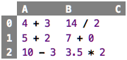
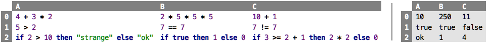
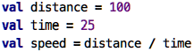

Go back to [Title Page / ToC](../..)

# Chapter 1: Values and Expressions

### Primitive Values

Numbers such as `7` or `42` are values. A value, as its colloquial
meaning implies, never changes. A `7` will always be a `7`, it won't
spontaneously become an `8`. An `8` is a different value. In the
following spreadsheet, all the `7`s are indistinguishable: the value
appears in three cells, but none of them is different than any other
one. They are exchangeable. Consider money: even though the various 10
EUR bills are different "objects" (indentified by their unique serial
numbers), to you, they are all the same. 10 EUR are 10 EUR.

&nbsp;&nbsp;[src](http://127.0.0.1:63320/node?ref=r%3A30b901aa-108c-498c-8b66-53a1d073f208%28chapter01_values%29%2F2522748330433039816)

There are other kinds of values, too. For example, `"Hello"` is a string
value, i.e., one that represents a text, and not a number. Again,
all `"Hello"`s are the same, there is no reason to prefer one value
`"Hello"` over another value `"Hello"`. A third important class of
values are truth values, also known as Booleans, after George
Boole, who contributed to mathematical logic. There are only two values
in this category, `true` and `false`. 

Numbers, strings and Booleans are the kinds of values we will work with
for now. They are available in all programming languages (sometimes
with other names), and most other, more complex values will be composed
from those.

>  The value `"42"` is also a string value, it represents the text that consists of the two digits `4` and `2`. It doesn't matter that the text could also be interpreted as a number; as long as it is enclosed in quotation marks, it is a string. Later in this tutorial we will learn how (and why) we would convert the text `"42"` into the number `42`.

### Computed Values and Expressions

Values can be computed. In the sheet below, all cells, when their value is
computed, will contain the value `7`. 

&nbsp;&nbsp;[src](http://127.0.0.1:63320/node?ref=r%3A30b901aa-108c-498c-8b66-53a1d073f208%28chapter01_values%29%2F2522748330433277340)

We call something like `3 + 7` or `14 / 2` an _expression_. When an
expression is evaluated, a value results. This is maybe the most
important sentence in this whole tutorial: **Evaluating an expression
results in a value.** The word "evaluation" literally means to "produce
a value". We will see that a whole class of useful programs can be
written using (increasingly more complicated) expressions.

The display of sheets can be changed to show the results of evaluating
the expressions in the cells; see the sheet below. The first two columns
are the evaluated versions of the first two columns of the previous
sheet. 

>  Explain how to switch notation

&nbsp;&nbsp;[src](http://127.0.0.1:63320/node?ref=r%3A30b901aa-108c-498c-8b66-53a1d073f208%28chapter01_values%29%2F2522748330433355383)

The third column contains three primitive values `7` . If a cell 
contains a primitive value (such as `7`), then
the result of the evaluation is the value itself -- evaluating a primitive value, or
_literal_, results in itself. Note how, in the spreadsheet computed values, when shown in
their evaluated form, use a grey background to indicate that you cannot
change that value directly, because it is computed; instead, you have to
change the underlying expression. 

>  You can press `F2` to reveal that
expression and then change it. You can see the background color change, and
you can then modify the expression. Press `F2` again to show the value.

You can evaluate an expression any number of times, the result will
always be the same. You could argue that each evaluation computes a
different, new value, but since we have seen above that all values with
the same denomination are identical, this observation is meaningless.
Thus, when you see an expression, you can _always_ evaluate it to get a
value. If, for whatever reason, you evaluate it several times, this does
not matter, you will just always get the same resulting value.
Conversely, if you know an expression didn't change, you can store the
resulting value when it is evaluated first, and, when asked to evaluate
again, you can return the previously computed value. 

>  The process of storing values once they have been computed and then
returning that stored value when asked (typically several times) is
called caching. Caching generally makes systems faster, but it also
requires more memory to store all those previously computed values. 
This is the kind of trade-off programmers have to make all the time.
However, note how this trade-off concerns the _engine_ that runs the
programs you write; as a person who writes programs, i.e., as the
reader of this tutorial, you don't care exactly _because_ from the
perspective of _what_ the program does, it doesn't matter -- the
semantics of what it means to evaluate an expression does not change.

### Basic Operators

We all know the basic arithmetic operators from school: `+`, `-`, `*`
and `/`. The last one, division, requires a little bit more discussion
later, because it is not obvious what should happen if we divide
something that does not result in an integer number (such as `7 / 2`):
should the result be a real number (`3.5`), or do we expect to get an
integer and the remainder (`3` remainder `1`). Also, the special case of
division-by-zero, which, we remember, is illegal, has to be
dealt with. But we ignore all of these details for now. 

The first row in the sheet below shows a few arithmetic operators, and
their results (in the sheet on the right). As you can see (and certainly
remember from school), you can chain arithmetic operators, according to
their precedence (`*` has higher precedence than `+`, for example).

&nbsp;&nbsp;[src](http://127.0.0.1:63320/node?ref=r%3A30b901aa-108c-498c-8b66-53a1d073f208%28chapter01_values%29%2F2522748330433368810)

From school we also know the comparison operators: `>` greater, `>=` greater or equal, `<` less, `<=` less or equal,
`==` equal and `!=` not equal (in school you probably used `=` for equality; in computing, the double `==` is common, so we stick to this convention).
These operators are defined on numbers, and in contrast to
arithmetic operators, they cannot be chained; which is why the second
row of the table above shows only pairs of numbers with an operator in
between. They evaluate to a Boolean value, i.e., they "say yes or no" to
your question whether one number is bigger/smaller/equal etc. to another
one. The arithmetic and comparison operators can of course be combined,
so you can write `3 + 5 > 7 * 2`, and this evaluates to `false`. For this
to make sense, the arithmetic operators must have higher precedende than the
comparison operators (the expression above must mean `8 > 14` and not 
`3 + false * 2`; that would make no sense. 

>  "Makes no sense" is handwaving for a type mismatch: you can only perform arithmetic operations on numbers, and `false` is not a number. We will return to types in [Chapter 3](../chapter03_types/index.md).

While there might be many more operators in any particular language, I
want to close this discussion with one example of the conditional
operator `if`; examples are shown in the third row of the spreadsheet above.
In contrast to all the other ones, it takes _three_ arguments, not two.
The first one must be a Boolean value; if it evaluates `true`, the overall
`if` evaluates to the expression given in the `then` part; otherwise it 
evaluates to the one given in the `else` part. Again, this one binds even
less tightly than the comparison operators, so you can write complex expressions
like the one given in the `C2` cell. We will return to more sophisticated means of making (conditional) decisions in  will return to types in [Chapter 7](../chapter07_decAndCalc/index.md).

### References and Dependencies

Let us go back to spreadsheets and take a look at the following one:

&nbsp;&nbsp;[src](http://127.0.0.1:63320/node?ref=r%3A30b901aa-108c-498c-8b66-53a1d073f208%28chapter01_values%29%2F2522748330434130263)

On the left we see the expressions in the cells, on the right we see the
values that result from evaluating the expressions. Like in Excel, we
use the `$` notation to refer to another cell by its coordinates. More
specifically, we retrieve the value that is evaluated from the
expressions in the cell identified by the coordinates so we can use it
to calculate the value for the current cell. So, when we evaluate cell
`B0`, then the evaluator sees the `$A0` reference which prompts it to
retrieve the expression in cell `A0` and evaluate it, resulting in `1`.
Since `B0` has no further content, this `1` becomes the value of `B0`.
Similarly for the `B1` cell: it gets the value of two referenced cells, and
_then_ adds those two values, producing `3` as the value of `B1`. And so
on with `B2`. 

This is a good place to introduce the notion of a dependency: a cell `X`
that contains a reference to another cell `Y` is said to _depend_ on `Y`.
You cannot compute the value of cell `X` without first having calculated
the value for cell `Y`. Dependencies are widespread in programming, and
they are often undesired because they "chain" parts of program together. 
We will learn several ways of avoiding such dependencies as we progress through this tutorial.

### Evaluation Order 

One thing dependencies do is to enforce an order in the evaluation of
expressions (or cells, in our example here). So, looking at cell `B2` in
the sheet above, the dependencies are as follows (the arrow should be
read as "depends on"):

    B2 -> B0
          -> A0
       -> B1
          -> A0
          -> A1
       -> A2   

Thus, since we have to evaluate the cells in the opposite order of their 
dependency, a possible evaluation order is 

    A0, B0, A0, A1, B1, A2, B2
    
Notice how in the evaluation of this cell we evaluate `A0` twice!
We know that evaluating the same expression multiple times
results in the same value. So this allows us to remember (cache) the value
calculated during the first evaluation and return it, without any new
computation, when we evaluate `A0` for the second time. If the
computation of `A0` is expensive (i.e., requires lots of computational
work itself), avoiding multiple recomputations can make a significant
difference in performance. And yes, in the intro I told you that I don't
want to teach you performance optimization, but I think it is still
useful to get some glimpse into how programmers go about making software
fast.
    
So, let us think about how we would evaluate the whole spreadsheet. The
first alternative is to linearly step through all cells and evaluate
each in turn. This means that, by the time we arrive at `B2`, all other
cells will already have a value, and we can use those previously computed values to perform the computation in `B2`. In the end, this means that our
dependencies effectively become
 
    B2 -> B0 [cached]
       -> B1 [cached]
       -> A2 [cached]

Because of caching, we can ensure that each cell is only ever computed
once, no matter how often it is referenced from other cells. 

What happens if the user changes the value of `A1` from its current
value `2` to, say, `42`? A naive strategy would reevaluate the whole
spreadsheet: whenever any value in any cell changes, we reevaluate
everything. However, there is a better strategy: because we know all the
dependencies of all the cells, we can only reevaluate those that depend
(directly or indirectly) on the one the user changed. So, based on our
dependency graph above, changing `A1` will result in the reevaluation of
`B1` and `B0` only (and, of course, of `A1` itself). This is obviously a much cheaper operation than reevaluating everything, and the ratio becomes more favourable the 	bigger the spreadsheet gets. 

So, what do we learn? Understanding the dependencies in a program allows
us to be clever about how we execute the program. This is true not just
in spreadsheets, but it is especially easy to spot there. It is a lesson
you will see all over programming.

### What does it mean to execute a program?

This is a good time to ask what it means to execute, or "run", a
spreadsheet-style program: it simply means updating the values of all
cells. As we have seen above, there are several (more or less clever)
strategies for doing this, but updating the cell values is all there is.
In addition, all the data the program works with is readily visible in
the spreadsheet, it is simply the content of all cells. This very simple
execution mechanism and the transparency regarding a program's internal
data (it's all in the cells!) makes spreadsheets so attractive and explains their widespread use (together with their nice formatting options). 

However, as we will see,
spreadsheets are just one member of a whole family of programming
languages called "functional", for which the same properties hold
regarding the execution model and the the transparency regarding
internal data. We will elaborate on this in detail as we proceed with
this tutorial.

### What are Cells?

In spreadsheets, cells play a central role: a spreadsheet is simply
a collection of cells. A cell contains "code", i.e., an expression, 
and when evaluated, it represents a value. A cell, thus, _identifies_ a
value: you identify it via its coordinates (e.g., `A0`, `B2`, etc.).
The value of a cell only changes as a consequence of a user's edits:
either the user changes a cell content directly (which triggers
its own reevaluation), or the cell is reevaluated because it depends on 
a cell that changed (for any of the two reasons given here).
  
One way of looking at this is that, whenever the user changes the
contents of any cell, the functional (spreadsheet) program is
reexecuted, updating all other cells. Another way of phrasing it is to
say that a functional program never really runs; the program _is_ the
computation.

>  If you have had some exposure to programming before, you have probably
heard the word "variable". Are cells variables? Not really.
Similarly to cells, a variable is a name for a value. But more
specifically, and more technically, it refers to a location in the
memory of a computer. What is stored inside that location _can change
during the execution of a program_. So, for example, during the first
half of a program's execution, the value of a particular variable might
be 0, and during the second half of the execution it might be 1.
Programs that use variables can contain _statements that update the
values of variables_. A spreadsheet, and more generally, a functional
program, cannot do this. Once a value is assigned to a cell during a
particular program execution, it will _never_ change (this realization
is what allowed us to cache the values in cells in our earlier
discussion on execution strategies). There is no "update cell value" 
command in spreadsheets. 
  

### Naming Cells and Values

To recap: a cell is simply a way of identifying (potentially computed)
values in a program. By default, you identify a cell through its
coordinates (`B4`). However, you can of course also give cells specific
names (again, the evaluated version is shown on the right):

&nbsp;&nbsp;[src](http://127.0.0.1:63320/node?ref=r%3A30b901aa-108c-498c-8b66-53a1d073f208%28chapter01_values%29%2F2522748330434253246)

This is still a regular spreadsheet, except that we now assigned names
to cells `A0` and `A1`, and we use these names in the expression in cell
`B0`. Names are really important to make a program understandable: the
above example is immediately and intuitively understandable. Make sure
you spend some brain cycles on good names!

Instead of naming cells, we can also extract this same information into
`val` declarations. You can imagine those simply as "cells outside a
spreadsheet": their value is still calculated only once (per program
execution). 

&nbsp;&nbsp;[src](http://127.0.0.1:63320/node?ref=r%3A30b901aa-108c-498c-8b66-53a1d073f208%28chapter01_values%29%2F2522748330434287327)

Finally, we can get rid of the spreadsheet completely:

&nbsp;&nbsp;[src](http://127.0.0.1:63320/node?ref=r%3A30b901aa-108c-498c-8b66-53a1d073f208%28chapter01_values%29%2F2522748330434283580)

Notice that we did _not_ change any of the semantics of the program
(semantics refers to what a program means, i.e., what happens when
it is executed). These are still three values, all are executed only
once per program execution, and the dependencies ...

    speed -> distance
          -> time
          
... determines the order in which they are executed. Congratulations,
you have just made your first step outside of spreadsheets, you wrote
a simple functional program. 

Continue with [Testing Programs](../chapter02_testing/index.md)

