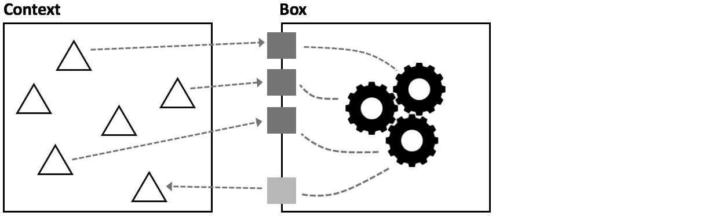
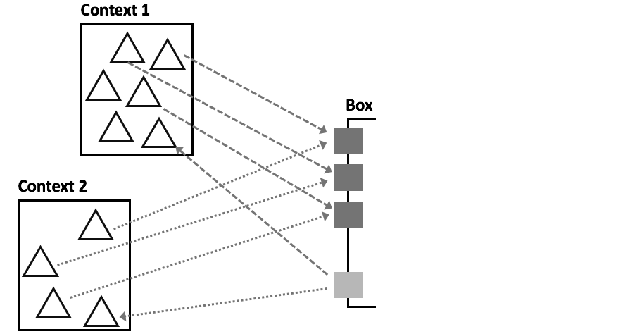
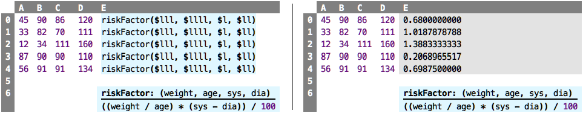
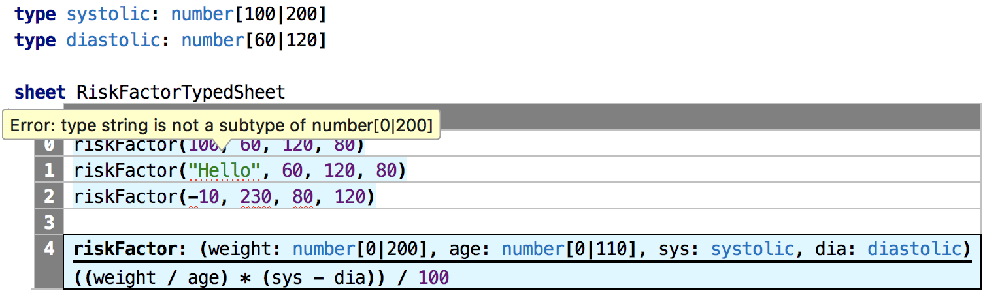
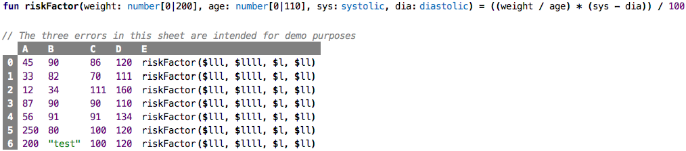
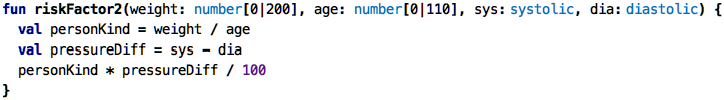
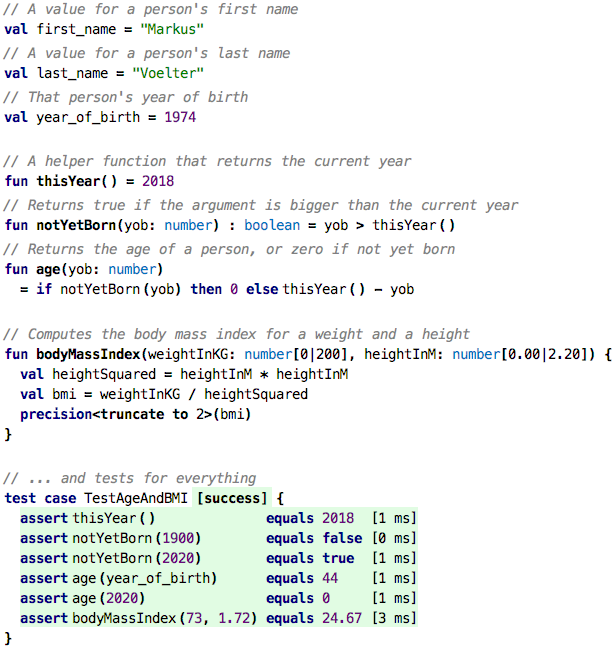

Go back to [Types](../chapter03_types/index.md)

# Chapter 04: Functions

### Motivation

Consider the following example sheet. It is taken from the domain of healthcare,
and the `E` column calculates a (hypothetical) risk factor based on a person's
age (`A`), their weight (`B`) and their diastolic (`C`) and systolic (`D`) blood
pressures.

&nbsp;&nbsp;[src](http://127.0.0.1:63320/node?ref=r%3A16d89834-7a42-43f5-ba48-4acec0e1fb39%28chapter04_functions%29%2F6455317040166694580)

You will notice several things. First, it would be nice if we could
rename the columns according to what is contained in them (weight, age,
diastolic, systolic); right now the spreadsheet language does not allow
us to do that. But second, the way we handle the formula is really bad.
First, the way we reference data (`$lll`) is not very readable, because
the reference expresses navigation as opposed to expressing meaning
(using the absolute references with `$A2` etc. would not change this).
And second, we repeat the formula in every line. This is really bad: we
might make a mistake copying it down the column, or we might
accidentally change something in only one row, or we might want to
update the expression consistently in all rows but then forget to update
it in one of them. So, this kind of duplication of identical code is
really bad.

The goal _must_ be to write down this expression in only one place.
However, there is a problem: because the expression contains _outgoing
dependencies_ to other cells, it is tied to its context -- the relative
addressing of cells would not work correctly if we moved the expression
to a central location in the sheet. Similarly with absolute references,
we would have to use other absolute references for each case. We must
somehow get rid of these references!

### From Cells with Dependencies to Parametrized Cells

In programming, whenever we want to get rid of (outgoing) dependencies, we use
the same proven approach: we create a new "box", and then parametrize it:

 

As the picture above shows, the parameters sit at the boundary between the 
newly created box and its context, i.e., the rest of the program. A parameter 
is a named value, just like the `val`s shown earlier. But it
is local to box, i.e., it can be used for computations only _inside_ 
that box. Inside the
box you put the expression, but you write it in terms _of only those
parameters_. So all dependencies in the expression are local to the box.
The box now has no dependencies on its environment, there are no outgoing
dependencies.

When you want to use the expression (for example, in all the locations where
the original expression was copied before), you map values from the using context
to the parameters, you "bind" the box to a context. The crucial point is that in
your program, you can have several such bindings, thereby using the box in
different contexts. 

 

So let us look at an example with cells. The blue cell labeled `riskFactor` at
the very bottom is this box. It declares the parameters, and then the expression
inside the `riskFactor` cell refers only to these parameters.

&nbsp;&nbsp;[src](http://127.0.0.1:63320/node?ref=r%3A16d89834-7a42-43f5-ba48-4acec0e1fb39%28chapter04_functions%29%2F6455317040166746748)

The cells that formerly contained copies of the risk factor expression now
simply refer to the `riskFactor` cell, providing specific values for the parameters;
the mapping is by position, i.e., the first passed value will be mapped to the
first parameter, and so on. 

We call a cell with parameters a _function cell_, and using it, with a
mapping of the parameters, is referred to as a _call_. When we evaluate
the call, we first map the parameters, and then run the expression
inside the function cell. The resulting value of the call is the value
of the expression when evaluated with the previously created binding. As
we can see, the resulting values are the same; but the code avoids the
duplication of the expression, it only exists once, inside the function
cell.

As a side remark: notice how in the evaluated version of the sheet (the one
on the right) the function cell is represented exactly the same way as in the
non-evaluated version on the left. Function cells themselves cannot be evaluated;
you need value bindings for the parameters to make it evaluatable. 

### The importance of Types in Function Cells

Let us look more closely at the expression inside a function cell: it is
completely independent of where and how it is called. Said differently,
when writing that expression inside the function cell, we make
assumptions about the kinds, i.e., types, of values that can be passed
into the function for it to work correctly. For example, in the
`riskFactor` function cell above, we perform arithmetic computations
with the parameters, so we implicitly assume that they are numbers. To
make function cells robust, we have to make this assumption explicit, by
specifying types for parameters. Once we have done this, the type
checker will report errors if we try to call with invalid parameters.

The reason why the types were optional for the `val`s discussed earlier
is that every `val`, right when it is declared, has to be given a value/expression.
The type checker can then infer the type of the `val` from the type of that
value. But parameters have no value; here, the types act as an explicit
constraint on the kinds/types of values the caller can use. 

The types are a simple form of a contract between the function cell and
its callers: in this case, the function cell expresses an expectation to
which the callers have to conform. We will see other forms of contracts
later in this tutorial.

### From Function Cells to Functions

Remember how we earlier moved the contents of cells into `val`s that
exist next to (independent from) sheets? We can do the same with
function cells. Not surprisingly, these end up in what we call
_functions_:

&nbsp;&nbsp;[src](http://127.0.0.1:63320/node?ref=r%3A16d89834-7a42-43f5-ba48-4acec0e1fb39%28chapter04_functions%29%2F6455317040168353366)

Have you spotted that the two last rows will result in type errors?

By default, a function is written with the keyword `fun`, followed by its name and the
list of parameters, each with a type, enclosed in parentheses. The expression that
implements the function, called the _body_, follows the equals sign. In terms of how it behaves, a 
function is identical to the function cells. In particular, they are called with
exactly the same syntax. 		

In many cases, functions will do relatively complicated things and thus
use more than a single, simple expression. Even the example above can
be refactored to be more readable:

&nbsp;&nbsp;[src](http://127.0.0.1:63320/node?ref=r%3A16d89834-7a42-43f5-ba48-4acec0e1fb39%28chapter04_functions%29%2F6455317040168374919)

Here, we use a block expression `{...}` as the body of the function. A
block can contain local values (also expressed with `val`) to represent
the results of intermediate calculations. The value of the overall block
is then computed by the _last_ expression in the block. 

Another reason why the types for the parameters are mandatory is that
otherwise the type checker cannot check the expression(s) in the body of
the function. In contrast, the type of the value _returned_ by the
function is optional; if you don't specify it, it is inferred from the
body. But you can make it explicit, too; it is specified behind the
argument list, separated, as usual, by a colon:

&nbsp;&nbsp;[src](http://127.0.0.1:63320/node?ref=r%3A16d89834-7a42-43f5-ba48-4acec0e1fb39%28chapter04_functions%29%2F6455317040168458553)
	
	

### Alternative Syntax for Functions

The notion of functions is ubiquitous. They are used all over the place.
Sometimes they "hide" behind a slightly different syntax, all with their
own trade-offs. But in terms of what they do and how they work, they are
identical. In this section we look at some examples of alternative function
syntax.

**Operators:** Remember `4 + 3`? This can be interpreted as a function
call to a function `+` with the arguments `4` and `3`, and it could be
written as `+(4, 2)`. In
some languages one can literally write this, often using names such as
`plus` instead of the symbol. A nested expression such as 
`(4 + 3) / (10 	* 2)` would then be represented as `div(plus(4, 3), mul(10, 2))`. 
For various technical reasons, this notation is easy to process from the
perspective of tools that process the program. But it is also quite
obvious that this representation is not as readable for humans, which is
why infix operators were introduced into all but very few languages. But
in terms of _semantics_, operators use is just function calls.

**Dot Expressions:** In many cases one uses a dot expression to invoke a
function. Instead of writing `fun(a, b, c)`, one writes `a.fun(b, c)`.
Usually the first argument naturally plays a special role compared to
the others; for example, it might be a collection to which we add an
element or it might be a more complex object, such as a `Car`, where we
increaseTheSpeed()` or something (we will talk about objects later). The
advantage of this notation is that one starts the syntactic form with
the first argument. So after one types `a.`, the tool can propose to the
user only those functions that are valid for `a` as the first argument.
This is in contrast to the regular function call syntax `fun(a, b, c)`,
where the editor has no context; it will propose all functions defined
in the system.

**Natural Language:** Going back to the `riskFactor` above, a call to the function
might be hard to read: it's essentially a list of numbers, and it is hard to remember
which number maps to which argument. An alternative, better call syntax would be 

    risk factor for 100 kg, 60 years old and blood pressure of 120 over 80

Here, the function would be defined using a text template with embedded arguments:
  
    risk factor for {weight: number[0|200]} kg, {age: number[0|110]} years old 
                and blood pressure of {sys: systolic} over {dia: diastolic}

If these text fragments become too long, readability suffers, but in
general, this can be a good way of making the code more accessible to
people who might only occasionally read code. We have also built systems
where each user can switch between the regular, positional arguments and
a text template.

### Taking Stock

Here is an example that wraps up everything we have learned so far:

&nbsp;&nbsp;[src](http://127.0.0.1:63320/node?ref=r%3A16d89834-7a42-43f5-ba48-4acec0e1fb39%28chapter04_functions%29%2F6455317040168536890)

The only new language construct is the `precision` expression. It can be
used to change the number of decimal digits on numbers. Remember that a
division always returns results with a infinite number of decimal digits.
Here we `truncate` it to two. Instead of truncating, `round up` and
`round down` would also be available options.

If you really want to understand only the basic basics of programming,
then this is the place to stop with this tutorial: values, expressions,
types, functions and tests are the absolute essence without which you
can't do anything useful. On the other hand, if you're comfortable so
far, why not continue and learn [more interesting things about programming.](../chapter05_structured/index.md)

Continue with [Structured Values](../chapter05_structured/index.md)

