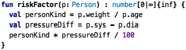
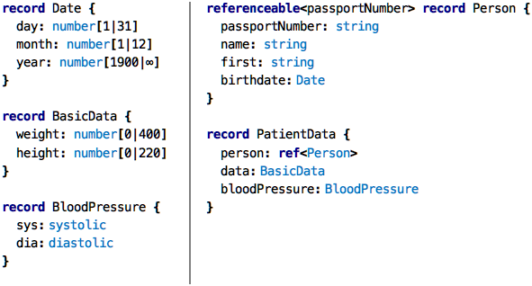
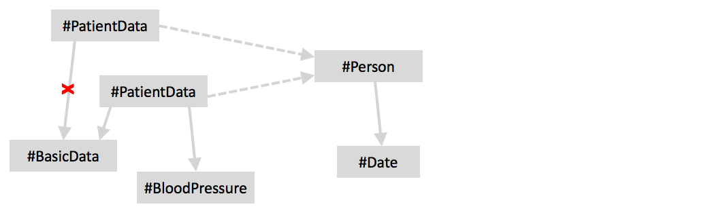
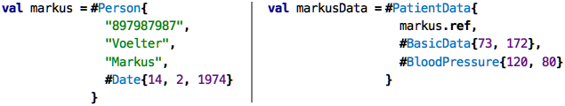
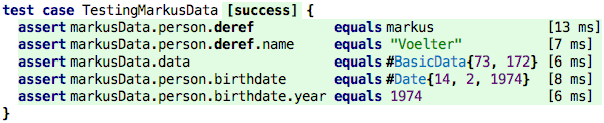
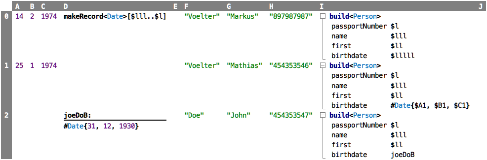
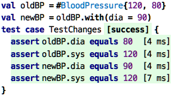
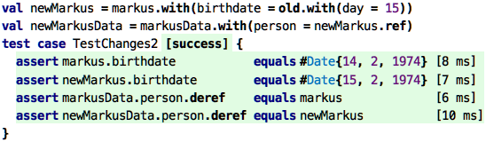

Go back to [Types](../chapter04_functions/index.md)

# Chapter 05: Structured Values

### Motivation

Remember the introductory example in the [previous chapter](../chapter04_functions/index.md)?

&nbsp;&nbsp;[src](http://127.0.0.1:63320/node?ref=r%3Ae00f4849-fe23-45e3-8ca0-de542fab6857%28chapter05_structured%29%2F6455317040172064278)

I am sure you have since forgotten what the first four columns stood
for. Let me remind you:  the `E` column calculates a (hypothetical) risk
factor based on a person's age (`A`), their weight (`B`) and their
diastolic (`C`) and systolic (`D`) blood pressures.

We identified two problems before: first, the columns don't have useful
names, so it is hard to remember -- as I demonstrated above -- what
these stand for. Second, there is the problem of the expression in
column `E` that is repeated five times. I the [previous
chapter](../chapter04_functions/index.md) we solved the latter issue
through function cells and functions. In this chapter, we will solve the
first issue.

To continue the argument: if you reread the paragraph before the last
one, what is the word that is central to the story? Right, _person_. How
is this concept represented in the spreadsheet? Or in the functions we
defined in the previous chapter? Not at all. This is the core of the
problem. What we need is a way of grouping data that belongs to, or is
part of, a single entity.

### Structured Types: Records ###

Looking at the spreadsheet above, it is a classic "data table": each row
represents a record, and the columns (maybe except the last one with the
function) represent fields, or _members_ of that record. So let's write
this down as a first-class declaration:

&nbsp;&nbsp;[src](http://127.0.0.1:63320/node?ref=r%3Ae00f4849-fe23-45e3-8ca0-de542fab6857%28chapter05_structured%29%2F6455317040172079031)

A `record` is literally like a row in a database, the members of the
record are typed names, just like the parameters of functions. So, not
much fundamtenally new here.

However, conceptually we have done something important: we have created
our own _abstraction_, the abstraction of a person in the context of our
system. You might say: well, it's not really a person if it doesn't have
a name and a date of birth. However, what is a person in the context of a
particular system, i.e., how we abstract the real-world concept into
software, is our decision. If we are interested in age, weight, and the
blood pressure, then it is perfectly ok to define a person as having those
specific fields. Other programmers, for other uses, might define a person
differently. You can, of course, argue that we should not call it a
`Person`, but rather a `Patient`. Or `PatientData`. Or
`DataForRiskFactorCalculation`. All are valid. It depends on what you
want to communicate to the reader of the program (because tools of
course don't care about names, as long as they are unique).  

### Records as Types ###

Record declarations like the one above can play the role of a type, similar to `number`,
`boolean` or `string`. In contrast to those, however, they are not built
into the language, they are defined by you, the programmer. With the `Person`
declaration above, you have created a type that you can use like any
other type. In particular, we can rewrite the `riskFactor` function that
we have seen before:

&nbsp;&nbsp;[src](http://127.0.0.1:63320/node?ref=r%3Ae00f4849-fe23-45e3-8ca0-de542fab6857%28chapter05_structured%29%2F6455317040172094667)

The function now takes a whole `Person` as its only argument. Inside the
function we can access the members of that person `p` using the dot
notation. Remember that we had introduced it earlier as an alternative
means of calling functions; now we use it to access members. This is why
the dot operation is often also called the _member access operation_. 

>  Remember our argument why the dot operation is useful
> to access things that _belong to_ something else (like the members belonging
> to the record)? It is because you first write down the thing itself, and then,
> after the dot, the tool will only propose, through code completion, the things
> that belong to the thing on the left of the dot. The user experience, in terms
> of the tool's ability to provide specific help, is improved. There is no 
> fundamental technical reason why one can't access the age of a person by writing 
> `age(p)` (where `p` is a `Person`) but it is much less convenient.

### Creating Record Instances ###

We have said above that the spreadsheet can be seen as a kind of
database where each row is a record. With what we now know about
`record`s, we have to phrase this a little bit more carefully. The
proper way of saying this is that each row is an _instance_ of a record
type, where that record type defines the fields that all of the
instances (rows) have. So the record defines the structure, the record
_instances_ defines specific rows, where each row provides a value for
each field/member of the record. 

>  We have come across the notion of an instance before,
> even though we did not make this explicit: `7` is an instance of the
> type `number`, `true` is an instance of the type `boolean` and `Hello`
> is an instance of the type `string`. So if `T` is the type of `<expr>`,
> then `<expr>` is an instance of `T`. _instanceof_ is the opposite of
> _has type_. We wil discuss instances much 
> more in [Chapter 8](../chapter08_instantiation/index.md).

So how can we create instances of
user-defined records, such as the `Person` above? Here is how:

&nbsp;&nbsp;[src](http://127.0.0.1:63320/node?ref=r%3Ae00f4849-fe23-45e3-8ca0-de542fab6857%28chapter05_structured%29%2F6455317040172188049)

So, to create an instance of a record, you use the `#` symbol, the name
of the record, and then values for the members, positionally, like in
functions, but using curly braces. Once we have values of `Person` type,
we can call the `riskFactor` function on them (and them, of course,
write tests):

&nbsp;&nbsp;[src](http://127.0.0.1:63320/node?ref=r%3Ae00f4849-fe23-45e3-8ca0-de542fab6857%28chapter05_structured%29%2F6455317040172258024)

>  Change this to regular function call syntax.

>  After you enter `#`, the tool directly gives you an empty
> template of the form `#<type>{}`. You can enter `Person` in the `<type>`
> slot and then proceed to enter the member values between the curlies.

### Using the dot Notation for the Risk Factor ###

Going back to the sheet above, the `E` column contained the call to the
`riskFactor` function. In some sense, the function was _part of_ the
record. Calling a function on a person, as in `riskFactor(p1)` is kind of
ugly. It would be much nicer to be able to write `p1.riskFactor()`. The
reasons why this is nice are

* it is syntactically similar to accessing members, creating a more homogeneous 
  feel for the overall program,
 
* and, as mentioned before, it allows for better tool support, because, after we have typed `p1.`, the
  tool will propose to us only members and the functions.
  
To make this possible, we have to make the `riskFactor` an _extension_
function. Extension functions are identical to regular functions, except
that they "extend" a type in the sense that you can call them with the
first argument before the dot:

&nbsp;&nbsp;[src](http://127.0.0.1:63320/node?ref=r%3Ae00f4849-fe23-45e3-8ca0-de542fab6857%28chapter05_structured%29%2F6455317040172302811)

### Data Modeling ###

Remember the discussion about whether `Person` is a good name for the
record we used so far in this chapter? Let's resolve this issue by
modeling that person/patient/blood pressure example a little bit more
seriously. Take a look at this:

&nbsp;&nbsp;[src](http://127.0.0.1:63320/node?ref=r%3Ae00f4849-fe23-45e3-8ca0-de542fab6857%28chapter05_structured%29%2F6455317040172321151)

On the left we see a few plain records for `Date`, the `BasicData` of a
person, and the two components of the `BloodPressure`. On the right, we
see two more records. Here there's something interesting. First the
`PatientData` uses `BloodPressure` as the type of one of its members. 
It also uses the `Person` as a type, but as a _reference_. This is an
important distinction:

The regular use of a record type (in a member) represents _composition_.
This means, that the respective 'BloodPressure' instance is _owned_ by
the referencing `PatientData` instance. A particular instance can only be
owned by _one_ other instance, and if that owning instance is deleted, the
composed/owned instance is deleted as well. Essentially, composition
creates a tree.
 
The relationship between `PatientData` and `Person` is different, it is
a (non-composition) reference. Here, the target instance has stands on
its own, it is _not_ owned by the referencing instance, and the
lifecycles are not connected: if the instance of `PatientData` is
deleted, the `Person` that was referenced by that particular
`PersonData` continues to exist. The same instance can be referenced
by several other instances.

Technically, the `PatientData` stores a reference to the `Person` by
storing the `Person`'s identifying member. That identifying member is
specified in the `referenceable<...>` part of the `Person` record
declaration. Only records that have a `referenceable` clause can be used
as a reference.

Here is an example using the records. We use the familiar `#` notation
to create instances, and we use the `.ref` operator to retrieve a
reference to a record, the `Person` in this case.

&nbsp;&nbsp;[src](http://127.0.0.1:63320/node?ref=r%3Ae00f4849-fe23-45e3-8ca0-de542fab6857%28chapter05_structured%29%2F6455317040172344290)

The `#` notation with its positional arguments can become hard to read
for bigger models. This is why, as an alternative, there is the `build`
expression. We can rewrite the code above as follows:

&nbsp;&nbsp;[src](http://127.0.0.1:63320/node?ref=r%3Ae00f4849-fe23-45e3-8ca0-de542fab6857%28chapter05_structured%29%2F6455317040172383860)

Here, the parameters are specified by name, and the representation is
more tree-like. Additionally, once you write something like
`build<Person>`, the tool directly pre-fills the necessary fields: 

&nbsp;&nbsp;[src](http://127.0.0.1:63320/node?ref=r%3Ae00f4849-fe23-45e3-8ca0-de542fab6857%28chapter05_structured%29%2F6455317040172450038)

### Path Expressions ###

Let's say we have the `markusData` in our hands. What can we do with it?
Here are some tests that demonstrate some uses:

&nbsp;&nbsp;[src](http://127.0.0.1:63320/node?ref=r%3Ae00f4849-fe23-45e3-8ca0-de542fab6857%28chapter05_structured%29%2F6455317040172457144)

You can join multiple dot expressions together into what is then called
a _path_ expression. If you come across a reference (as in
`PatientData.person`) you have to use `.deref` to get to the actual
record instance from the reference.

### Closing the Loop with Spreadsheets ###

Of course, all of these expressions can be used in spreadsheets, if you
so desire. There is one expression that is specifically built to work
with records in spreadsheets: `makeRecord`, an example is shown in `D0`:

&nbsp;&nbsp;[src](http://127.0.0.1:63320/node?ref=r%3Ae00f4849-fe23-45e3-8ca0-de542fab6857%28chapter05_structured%29%2F6455317040172625211)

`makeRecord` constructs an instance of the record given between the
angle brackets, by taking the values specified by the linear cell range
given in between the square brackets.

### Changing Record Values

So let's say you want to change the systolic blood pressure after you
perform a new measurement. Let's say, it is currently
`#BloodPressure{120, 80}` and you want to change it to
`#BloodPressure{120, 90}`. How do you do this?

The first thing we have to remember, from the very beginning of this
tutorial, is that _values never change_. If we add `8 + 5` nothing
ever happens to those two values; instead we produce a _new_ value `13`.
In fact, the definition of what a value is relies on the fact that it
never changes. And at least for now, we will stay with this definition.
So what do we do about changing the blood pressure? Well, we create a
new instance of the record with the changed diastolic pressure. So:

&nbsp;&nbsp;[src](http://127.0.0.1:63320/node?ref=r%3Ae00f4849-fe23-45e3-8ca0-de542fab6857%28chapter05_structured%29%2F6455317040172868475)

The `with` operation allows you to create a copy of the current record
value, with one or more of the members changed. The original value, the
one on which you called `with`, remains unchanged, as the test shows.
Here is another example that changes a nested instance. You can see how
we use the `old` keyword to refer to the value that is in the orignal
value, the one on which we called `with`.

&nbsp;&nbsp;[src](http://127.0.0.1:63320/node?ref=r%3Ae00f4849-fe23-45e3-8ca0-de542fab6857%28chapter05_structured%29%2F6455317040172977675)

Why is this useful? Why don't just actually change a member? The reason
is that this means our programs do not have to deal with time! If we
were to actually _change_ a value, then we as programmers, and all our
tools, will have to track _how a value changes over time_. This makes
everything more complicated. Sometimes this is in fact necessary, and we
will cover changing, or _mutable_ data later in the tutorial. But for
now, we stick with immutable data.

Here is another reason. Imagine one part of the program, let's say part
`S`, hands a value to another part of the program `R` for it to do
something with. Now, while `R`  performs its work, that other part `S`
of the program continues to run and modifies the value. This would mean
that from the perspective of the receiver `R`,  the value changes on its
own, spontaneously. This is really really bad for correctness of
programs. If values can never change, this whole class of errors that can
occur if parts of programs can run _concurrently_ are just impossible. 

For now, we don't have concurrency in our progams. And it is quite
possible that you will neer explicitly deal with concurrency in the code
you write. But it is _very_ likely that the code you write, for example,
using a DSL for tax calculation, is actually executed in a concurrent
context. And that context explicitly relies on your data being immutable.

### Wrap Up  

With records, composition and references you can describe essentially
arbitrarily structured data. Together with functions to express
behavior, this gets your knowledge about programming almost to a
workable level. What's missing is collections. We will discuss those
next.

Continue with [Collections](../chapter06_collections/index.md)

