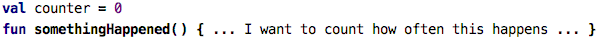
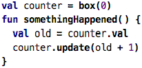
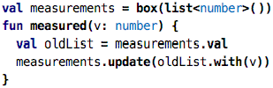
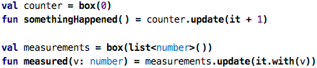
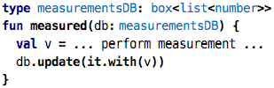
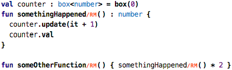
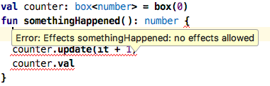
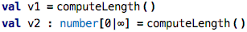

Go back to [Types](../chapter08_instantiation/index.md)

# Chapter 09: Time and State

If you mentally go through the previous eight chapters, you will notice (and I have
said so many times in these chapters) that nothing really every changed in the programs
we wrote. We only created values. Some of these values were based on computations that
used other, dependent values. But a particular value never changed. As we went along,
I explained why this is useful: it makes programs simpler to understand and to debug,
and it also helps with concurrent programs because a value cannot be modified by part
A of a program while part B, which runs in parallel at the same time, uses the value.

Also, because every part of a program (expression, function) always results in the 
same value when executed (with the same arguments), the execution strategy for such
programs is very simple. 

A drawback, of course, is that this limits the kinds of programs you can write. 
Sometimes you do really want to change something. Here are some examples:

* You want to keep track of a set of measurements, so you have to store each additional measurements in some kind of list. This is the classical database use case. 

* Your program might contain code that interacts with the outside world. For example, 
it might send an email if it encounters a particular condition. Sending an email is
an example of an _effect_ on something _outside_ the actual software system. This
incurs additional complexities.

We cannot express these things with the toolkit we have learned so far. In this chapter,
we will learn the basics of performing such tasks.

## Boxes

We have postulated very early on that values never change. And we don't want to give
up this idea. It is really really useful to know, when writing code, that the value you
have in hand cannot change while you use it, either because another part of the program
runs at the same time, or because you explicitly call some other part of the program, and
that other part changes a value (without making this obvious to you). So we will stay
with this characteristic.

On the other hand ... let's look at the following program:

&nbsp;&nbsp;[src](http://127.0.0.1:63320/node?ref=r%3A1fd4f7c3-a5ff-4200-9ea0-4fb5c9a87787%28chapter09_timeAndState%29%2F3487973603071082475)

The `somethingHappened` function will be called by an outside entity (remember the Driver we introduced earlier?) whenever something interesting happens in the world. And our program
is supposed to do the simplest thing possible: count how often that interesting thing
happens. Or the following one:
  
&nbsp;&nbsp;[src](http://127.0.0.1:63320/node?ref=r%3A1fd4f7c3-a5ff-4200-9ea0-4fb5c9a87787%28chapter09_timeAndState%29%2F3487973603071083096)

Here we are called when a new measurement is taken by the environment, and we want to
store it in our list of measurements. We can't really do this, because we cannot change
the value `counter` or `measurements`. Remember that there is no "assignment" that 
changes the value. 

To get around this apparent contradiction, we use something that you might call a trick.
But it is a useful trick, as we will see in this chapter. We introduce the notion of a 
box. A _box_ is a value that holds another one. The contents of a box can change over
time. But each value that is put into the box or taken out of the box is unchangeable, 
as before. So let us rewrite the counter example using a box:

&nbsp;&nbsp;[src](http://127.0.0.1:63320/node?ref=r%3A1fd4f7c3-a5ff-4200-9ea0-4fb5c9a87787%28chapter09_timeAndState%29%2F3487973603071083761)

First, we make the `counter` value a box that contains a number (zero in this case). 
So, the value in `counter` stays the same; it is the same box all the time. But the 
contents of that box can change. In the `somethingHappened` function we perform such
a change. We first grab the current value of the box using the `.val` operation on 
the box and store it in a local value `old`. We then update the contents of the box
by storing _a new value_ `old + 1`. The old value, whoever took it out before, does
not change. But the box holds something different now.

How does it look for the measurements?

&nbsp;&nbsp;[src](http://127.0.0.1:63320/node?ref=r%3A1fd4f7c3-a5ff-4200-9ea0-4fb5c9a87787%28chapter09_timeAndState%29%2F3487973603071087310)

Exactly the same structure, except that instead of using the `+` operator for the
number, we use the `with` operator for lists.

It is a little bit annoying that we always have to explicitly grab the old value
and then update a new one. So there is a syntactic shortcut to achieve this:

&nbsp;&nbsp;[src](http://127.0.0.1:63320/node?ref=r%3A1fd4f7c3-a5ff-4200-9ea0-4fb5c9a87787%28chapter09_timeAndState%29%2F3487973603071092777)

The `it` expression, when used inside the `update`, refers to the current value in the
box before we update. This way, we can write the update code much more concisely 
than before.

Of course you can pass boxes around to avoid dependencies on global data. 
For example, we could rewrite the measurement example as follows:

&nbsp;&nbsp;[src](http://127.0.0.1:63320/node?ref=r%3A1fd4f7c3-a5ff-4200-9ea0-4fb5c9a87787%28chapter09_timeAndState%29%2F3487973603071102879)

Boxes allow us to use every (immutable)
value as a mutable data structure by putting it into a box. All operators, such
as `+` for numbers or `.with` for lists still work -- we simply use it inside
the `update` to, if you will, get a mutable version of them. That's quite handy.

## Effects

Let us revisit some of the guarantees about values we discussed about before. 
In particular, we said that we can evaluate any expression any number of times,
because it will always result in the same value. Similarly, if we know that the 
values an expression depends on did not change, we do not have to evaluate an 
expression at all. We can just reuse a value that was computed earlier. Are
these two statements still true if we use boxes? Look at this code:

&nbsp;&nbsp;[src](http://127.0.0.1:63320/node?ref=r%3A1fd4f7c3-a5ff-4200-9ea0-4fb5c9a87787%28chapter09_timeAndState%29%2F3487973603071109291)

Again, we declare a global box, and the `somethingHappened` function updates
that box with an incremented value. It then also returns the current contents.
This function is called from `someOtherFunction` which multiplies the returned
value by two. Not a very realistic examples, but it will make my point.

So, can we evaluate the expression `somethingHappend() * 2` any number of times
and expect the same result? Can we cache previous values? Of course we cannot!
This is because the function called by `somethingHappend()` changes the world:
it updates the box. So calling it several times updates the box several times,
counting up the counter. Similarly, because it returns the contents of that 
box, the function returns something different every time we call it! This is
very much at odds with our fundamental assumptions made earlier.

So? What do we do? We can simpliy disallow code that changes box contents
(and thus, boxes). This brings us back to parts one and two of this tutorial;
and for many use cases this is perfectly fine. We had discussed this in these
earlier parts. But it we want to stick with boxes and the ability to modify
their contents, then we should do this in a controlled way. We have to know
which expressions are not pure, i.e., either read or modify something that
can change over time (i.e., boxes).

Enter effects. The code examples that dealt with boxes in this chapter so far 
were all wrong in an important way: they did not deal correctly with effects.
What is an effect? For now, an effect is changing the contents of a box or 
reading the contents of a box. The problem with caching and multiple executions
of expressions above illustrated this. So how should this last code example 
really look?

&nbsp;&nbsp;[src](http://127.0.0.1:63320/node?ref=r%3A1fd4f7c3-a5ff-4200-9ea0-4fb5c9a87787%28chapter09_timeAndState%29%2F3487973603071109291)

Notice the `/RM` marks thoughout the code. Let's start from the inside out.
If you use a `.val` anywhere in your code, this means that you are grabbing
the value from a box. Since you do not know who and when puts a value
into the box, the execution engine _can never assume that the value is the
same as when you tried to read it last_. So the engine cannot cache. This
is called a _read effect_. Similarly, the `update` puts something into a box
and this way _modifies the universe_. So we cannot repeat the execution as
often as we want. We call this a _modify effect_. If you use the `it` inside
an update, then you also read the original value, so that's a read effect. 

So, summing up, the code inside the body of the `somethingHappened` function
has read and modify effects. If you write this as a plain function, as before,
you will get an error:

 
The error means that in a normal function, you cannot have effect because
the system assumes the function is pure (so it can cache and/or execute repeatedly).
To fix this, you have to attach the `/RM` flag that says to the system that
this function is _not_ pure and instead has a read (`R`) and a modify (`M`)
effect.

Of course, when you now call this function, then that expression has the 
same effects; which is why the system automatically attaches the `/RM` 
to the function call inside `someOtherFunction`. Of course, this now makes
the `someOtherFunction` effectful and you have to attach the `/RM` there.

Using this effect tracking, both the user and the execution engine are always aware
about where effects occur; in particular, the execution engine can take this into
account when making decisions about caching. Also, as long as the program does
not use any box types, we know the program is guaranteed not to have effects and
we can cache and reexecute as much as we like.

## Inference vs. Specification

If you look carefully at the code above you will notice that 

* the `val` or `update` operations do not have the `/RM` flags
* neither does the `*` operator, even when one of its arguments (the function call) has it,
* for function calls the flags are automatically attached,
* and for function (that contain effectful code) you have to attach the `/R`, `M` or `RM` flags manually. 

Why these differences? It is a trade-off between several forces. First, if we were
to show the effect on every node that has one, programs would be full of effect markers.
That is annoying. On the other hand, effects are especially relevant for function definitions
and calls, which is why they are marked there. When then the need to manually attach it
to functions? That is the difference between specfication+check vs. inference.

But _not_ attaching an effect flag to a function, you express your intent of ensuring
that the function is pure. So if you do things inside the function that actually have 
an effect, you get an error. If the effectfulness would simply be propagated automatically,
then it is much easier for effects to "spread" though your code, uncontrolled. So by
requiring the programmer to explicitly allow effects in a function (by manually
attaching the flag), the user gets a degree of control.

We have a similar issue with types. Consider the following two alternatives:

&nbsp;&nbsp;[src](http://127.0.0.1:63320/node?ref=r%3A1fd4f7c3-a5ff-4200-9ea0-4fb5c9a87787%28chapter09_timeAndState%29%2F3487973603071586602)

In the first value, the type is automatically inferred from the function call.
In the second case, you express your intent that the number must be greater than zero.
In the second case you get an error if your length is negative, in the first one, you don't.
So the second case is an example of, if you will, a little bit of inlined test code:
you express your expecatation, and the system then checks against it. In the first case,
you take whatever you want. 

An explicitly specified effect flag -- or the lack thereof -- makes your expecation about
effectfulness explicit. The tool will report an error if what you specify is not fulfilled.

How to write "safe" code.

