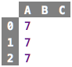
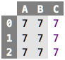

# Chapter 1: Values

### Primitive Values

Numbers such as `7` or `42` are values. A value, as its colloquial
meaning implies, never changes. A `7` will always be a `7`, it won't
spontaneously become an `8`. The `8` is a different value. In the
following spreadsheet, all the `7`s are the same. The value appears in
three cells, but one of them is not any different than another one: they
are exchangeable. Consider money: even though the varios 10 EUR bills
are different "objects" (as exemplified by their serial numbers), to
you, they are all the same. 10 EUR are 10 EUR.

&nbsp;&nbsp;[src](http://127.0.0.1:63320/node?ref=r%3A30b901aa-108c-498c-8b66-53a1d073f208%28chapter01_values%29%2F2522748330433039816)

There are other kinds of values, too. For example, `"Hello"` is a string
value, i.e., one that does not represent a number, but a text. Again,
all `"Hello"`s are the same, there is no reason to prefer one value
`"Hello"` over another value `"Hello"`. A third important class of
values are truth values, also known as Boolean values, after George
Boole, who contributed to mathematical logic. There are only two values
in this category, `true` and `false`. Numbers, strings and Booleans are
the kinds of values we will work with for now.

### Computed Values and Expressions

Values can be computed. In the sheet below, all cells, when calculated,
result in the value `7`. 

&nbsp;&nbsp;[src](http://127.0.0.1:63320/node?ref=r%3A30b901aa-108c-498c-8b66-53a1d073f208%28chapter01_values%29%2F2522748330433277340)

We call something like `3 + 7` or `14 / 2` an expression. When an
expression is evaluated, a value results. This is maybe the most
important sentence in this whole tutorial: **Evaluating an expression
results in a value.** The word "evaluation" literally means to "produce
a value". We will see that a whole class of useful programs can be
written with (increasingly more complicated) expressions.

The display of sheets can be changed to show the results of evaluating
cells; see the sheet below. The first two columns are the evaluated
versions of the first two columns of the previous sheet. 

&nbsp;&nbsp;[src](http://127.0.0.1:63320/node?ref=r%3A30b901aa-108c-498c-8b66-53a1d073f208%28chapter01_values%29%2F2522748330433355383)

The third column contains the three primitive values `7` from the first
example sheet. If a cell contains a primitive value (such as `7`), then
the result is the value itself -- evaluating a primitive value, or
_literal_, results in itself. Note how computed values, when shown in
their evaluated form, use a grey background to indicate that you cannot
change that value, because it is computed; instead, you have to change
the underlying expression.

You can evaluate an expression any number of times, the result will
always be the same. You could argue that each evaluation computes a
different, new value, but since we have seen above that all values with
the same denomination are identical, this observation is meaningless.
Thus, when you see an expression, you can _always_ evaluate it to get a
value. If, for whatever reason, you evaluate it several times, this does
not matter, you will just always get the same resulting value.
Conversely, if you know an expression didn't change, you can cache the
resulting value and, when asked to evaluate, you can return the cached
value. 

### Basic Operators

We all know the basic arithmetic operators from school: `+`, `-`, `*`
and `/`. The last one, division, requires a little bit more discussion
later, because it is not obvious what should happen if we divide
something that does not result in an integer number (as in `7 / 2`):
should the result be a real number (`3.5`), or do we expect to get an
"approximate" integer and the remainder (`3` remainder `1`). Also, the
special case of division-by-zero, which, as we know from math, is
illegal, has to be dealt with. But we ignore all of these details for
now. The first row in the sheet below shows a few arithmetic operators,
and their results (in the sheet on the right). As you can see (and
remember from school), you can chain arithmetic operators, according to
their precedence (`*` has higher precedence than `+`, for example).

&nbsp;&nbsp;[src](http://127.0.0.1:63320/node?ref=r%3A30b901aa-108c-498c-8b66-53a1d073f208%28chapter01_values%29%2F2522748330433368810)

We also know the comparison operators: `>`, `>=`, `<`, `<=`, `==` and
`!=`. They are defined on numbers, and in contrast to arithmetic
operators, they cannot be chained; which is why the second row of the
table above shows only pairs of numbers with an operator in between.
They evaluate to a Boolean value, i.e., they "say yes or no" to your
question whether one number is bigger/smaller/equal etc. to another one.
The arithmetic and comparison operators can of course be combined, so you
can write `3 + 5 > 7 * 2`, and this evaluates to false. For this to make
sense, the arithmetic operators must bind more tightly than the comparison
operators (the expression above must mean `8 > 14` and not `3 + false * 2`, 
because the latter makes no sense.  

While there might be many more operators in any particular language, I
want to close this discussion with one example of a conditional
operator; examples are shown in the third row of the spreadsheet above.
In contrast to all the other ones, it takes _three_ arguments, not two.
The first one must be a Boolean value; if it evaluates `true`, the overall
`if` evaluates to the expression given in the `then` part; otherwise it 
evaluates to the one given in the `else` part. Again, this one binds even
less tightly than the comparison operators, so you can write complex expressions
like the one given in the `$C2` cell.

