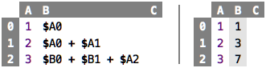

# Chapter 1: Values and Expressions

### Primitive Values

Numbers such as `7` or `42` are values. A value, as its colloquial
meaning implies, never changes. A `7` will always be a `7`, it won't
spontaneously become an `8`. The `8` is a different value. In the
following spreadsheet, all the `7`s are the same. The value appears in
three cells, but one of them is not any different than another one: they
are exchangeable. Consider money: even though the varios 10 EUR bills
are different "objects" (as exemplified by their serial numbers), to
you, they are all the same. 10 EUR are 10 EUR.

&nbsp;&nbsp;[src](http://127.0.0.1:63320/node?ref=r%3A30b901aa-108c-498c-8b66-53a1d073f208%28chapter01_values%29%2F2522748330433039816)

There are other kinds of values, too. For example, `"Hello"` is a string
value, i.e., one that does not represent a number, but a text. Again,
all `"Hello"`s are the same, there is no reason to prefer one value
`"Hello"` over another value `"Hello"`. A third important class of
values are truth values, also known as Boolean values, after George
Boole, who contributed to mathematical logic. There are only two values
in this category, `true` and `false`. Numbers, strings and Booleans are
the kinds of values we will work with for now.

### Computed Values and Expressions

Values can be computed. In the sheet below, all cells, when calculated,
result in the value `7`. 

&nbsp;&nbsp;[src](http://127.0.0.1:63320/node?ref=r%3A30b901aa-108c-498c-8b66-53a1d073f208%28chapter01_values%29%2F2522748330433277340)

We call something like `3 + 7` or `14 / 2` an expression. When an
expression is evaluated, a value results. This is maybe the most
important sentence in this whole tutorial: **Evaluating an expression
results in a value.** The word "evaluation" literally means to "produce
a value". We will see that a whole class of useful programs can be
written with (increasingly more complicated) expressions.

The display of sheets can be changed to show the results of evaluating
cells; see the sheet below. The first two columns are the evaluated
versions of the first two columns of the previous sheet. 

&nbsp;&nbsp;[src](http://127.0.0.1:63320/node?ref=r%3A30b901aa-108c-498c-8b66-53a1d073f208%28chapter01_values%29%2F2522748330433355383)

The third column contains the three primitive values `7` from the first
example sheet. If a cell contains a primitive value (such as `7`), then
the result is the value itself -- evaluating a primitive value, or
_literal_, results in itself. Note how computed values, when shown in
their evaluated form, use a grey background to indicate that you cannot
change that value, because it is computed; instead, you have to change
the underlying expression.

You can evaluate an expression any number of times, the result will
always be the same. You could argue that each evaluation computes a
different, new value, but since we have seen above that all values with
the same denomination are identical, this observation is meaningless.
Thus, when you see an expression, you can _always_ evaluate it to get a
value. If, for whatever reason, you evaluate it several times, this does
not matter, you will just always get the same resulting value.
Conversely, if you know an expression didn't change, you can cache the
resulting value and, when asked to evaluate, you can return the cached
value. 

### Basic Operators

We all know the basic arithmetic operators from school: `+`, `-`, `*`
and `/`. The last one, division, requires a little bit more discussion
later, because it is not obvious what should happen if we divide
something that does not result in an integer number (as in `7 / 2`):
should the result be a real number (`3.5`), or do we expect to get an
"approximate" integer and the remainder (`3` remainder `1`). Also, the
special case of division-by-zero, which, as we know from math, is
illegal, has to be dealt with. But we ignore all of these details for
now. The first row in the sheet below shows a few arithmetic operators,
and their results (in the sheet on the right). As you can see (and
remember from school), you can chain arithmetic operators, according to
their precedence (`*` has higher precedence than `+`, for example).

&nbsp;&nbsp;[src](http://127.0.0.1:63320/node?ref=r%3A30b901aa-108c-498c-8b66-53a1d073f208%28chapter01_values%29%2F2522748330433368810)

We also know the comparison operators: `>`, `>=`, `<`, `<=`, `==` and
`!=`. They are defined on numbers, and in contrast to arithmetic
operators, they cannot be chained; which is why the second row of the
table above shows only pairs of numbers with an operator in between.
They evaluate to a Boolean value, i.e., they "say yes or no" to your
question whether one number is bigger/smaller/equal etc. to another one.
The arithmetic and comparison operators can of course be combined, so you
can write `3 + 5 > 7 * 2`, and this evaluates to false. For this to make
sense, the arithmetic operators must bind more tightly than the comparison
operators (the expression above must mean `8 > 14` and not `3 + false * 2`, 
because the latter makes no sense.  

While there might be many more operators in any particular language, I
want to close this discussion with one example of a conditional
operator; examples are shown in the third row of the spreadsheet above.
In contrast to all the other ones, it takes _three_ arguments, not two.
The first one must be a Boolean value; if it evaluates `true`, the overall
`if` evaluates to the expression given in the `then` part; otherwise it 
evaluates to the one given in the `else` part. Again, this one binds even
less tightly than the comparison operators, so you can write complex expressions
like the one given in the `$C2` cell.

### References and Dependencies

Let us go back to spreadsheets, and take a look at the following one:

&nbsp;&nbsp;[|src](http://127.0.0.1:63320/node?ref=r%3A30b901aa-108c-498c-8b66-53a1d073f208%28chapter01_values%29%2F2522748330434130263)

On the left we see the expressions in the cells, on the right we see the
values that result from evaluating the expressions. As we know from
Excel, we use the `$` notation to refer to another cell by its
coordinates. More specifically, we use the value that is evaluated from
the expressions in the cell identified by the coordinates to calculate
the value for the current cell. So, when we evaluate cell `B0`, then the
evaluator sees the `$A0` notation which prompts it to retrieve the
expression in cell `A0` and evaluate it, resulting in `1`. Since `B0`
has no further content, this `1` becomes the value of `B0`. Similarly
for the `B1` cell; it gets the value of two other cells, and _then_ adds
those two values, producing `3` as the value of `B1`. And so on with
`B2`. 

This is a good place to introduce the notion of a dependency: a cell `X`
that contains a reference to another cell `Y` is said to _depend_ on `Y`.
You cannot compute the value of cell `X` without first having calculated
the value for cell `Y`. Dependencies are widespread in programming, and
often they are undesirable. So we will see several ways of avoiding such
dependencies as we progress through this tutorial.

### Evaluation Order 

Dependencies enforce an order in the evaluation of expressions (or cells,
in our example here). So, looking at cell `B2` in the sheet above, the dependencies
are as follows (the arrow should be read as "depends on"):

    B2 -> B0
          -> A0
       -> B1
          -> A0
          -> A1
       -> A2   

Thus, since we have to evaluate the cells in the opposite order of their 
dependency, a possible evaluation order is 

    A0, B0, A0, A1, B1, A2, B2
    
Notice how in the evaluation of this cell we evaluate `A0` twice! However,
we know that evaluating the same expression multiple times results in the same
value. So this allows us to cache the value calculated in the first evaluation
and return it, without any new calculation, when we evaluate `A0` for the
second time. If the calculation of `A0` is expensive (i.e., requires lots of
computational work), avoiding calculating it twice make a significant difference
in performance. And yes, in the intro I told you that I don't want to teach you
performance optimization, but I think it is still useful to get some glimpse 
into how programmers go about making software fast.
    
So, let us think about how we can evaluate the whole spreadsheet. The first
alternative is to linearly step through all cells and evaluating each in turn. 
This means that, by the time we arrive at `B2`, all other cells will already have
a value, and we can use the cached values to perform the computation. In the end,
this means that our dependencies effectively become
 
    B2 -> B0 [cached]
       -> B1 [cached]
       -> A2 [cached]

What happens if the user changes the value of `A1` from 2 to 42? Well, a naive
strategy would be to reevaluate the whole spreadsheet. So whenever any value in 
any cell changes, we reevaluate everything. This is a possible strategy. However,
there is a better one: because we know all the dependencies of all the cells, we 
can only reevaluate those that depend (directly or indirectly) on the one the user
changed. So, based on our dependency graph above, changing `A1` will result in
the reevaluation of `B1` and `B0` only, obviously a much cheaper operation.
So, what do we learn? Understanding the dependencies in a program allows us
to be clever about how we execute the program. This is a lesson you will see 
all over programming.

### What does it mean to execute a program?

It is interesting to understand what it means to execute, or "run", a
spreadsheet-style program: it simply means updating the values of all
cells. As we have seen above, there are several (more or less clever)
strategies on how to do this, but updating the cell values is all there
is. In addition, all the data the program works with is readily visible
in the spreadsheet, it is simply the content of all cells. This very
simple execution and transparency regarding a program's internal data
makes spreadsheets so attractive and ensures their widespread use.
However, as we will see, spreadsheets are just a particular kind of a
style of programming called "functional", for which the same properties
hold regarding the execution model and the the transparency regarding
internal data. We will elaborate on this in detail as we proceed with
this tutorial.

### What are Cells?

In spreadsheets, cells play a central role: a spreadsheet is simply
a collection of cells. A cell contains "code", i.e., an expression, 
and when evaluated, it contains a value. A cell, thus, _identifies_ a
value: you identify it via its coordinates (e.g., `A0`, `B2`, etc.).

If you have had some exposure to programming before, you have probably
heard the word "variable". Are cells variables? Well, not really.
Similarly to cells, a variable is a name for a value. But more
specifically, and more technically, it refers to a location in the
memory of a computer. What is stored inside that location can _change
during the execution of a program_. So, for example, during the first
half of a program's execution, the value of a particular variable might
be 0, and during the second half of the execution it might be 1.
Programs that use variables can contain _statements that update the
values of variables_. A spreadsheet, and more generally, a functional
program, cannot do this. Once a value is assigned to a cell during a
particular program execution, it will _never_ change (this realization
is what allowed us to cache the values in cells in our earlier
discussion on execution strategies). There is no "update cell value" 
command in spreadsheets. So, there are only two reasons why a cell's
contents can change:

* The user updates the cell content by editing it (which triggers
  a new "execution" of the spreadsheet)

* Or the cell is reevaluated _once_ in an execution of the spreadsheet,
  either because it depends on a cell the user changed, or because the
  spreadsheet is reevaluated completely.
  

### Naming Cells

Again, to recap: a cell is simply a way of identifying (potentially
computed) values in a program. By default, you identify a cell through
its coordinates. However, you can of course also give cells specific
names:

So, this is probably 
Cells are essentially names for values, 2 dim

