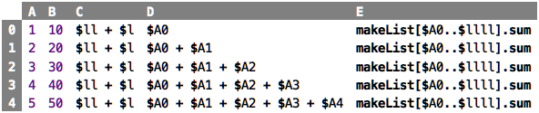
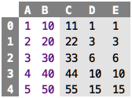
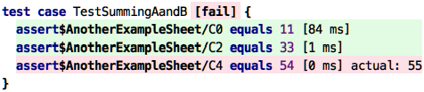

# Chapter 2: Testing

### Trying out Programs

So far, we have assessed the correctness of a program by "looking" at it. 
For example, consider the following sheet, which is intentionally a little
bit more complicated than the ones we saw so far:

&nbsp;&nbsp;[src](http://127.0.0.1:63320/node?ref=r%3A070f5d99-4e80-4529-a7cc-03acd3a7433d%28chapter02_testing%29%2F2522748330434301191)

The first two columns are constants. The third column sums up the first
and the second. It uses a second way of referencing cells: instead of
using their absolute coordinates, we use relative navigation. `l` goes
one cell to the left, `ll` two, and so on (there are similar "moves" for
`r`ight, `u`p and `d`down). So, are these calculations correct? Here
are the values:

&nbsp;&nbsp;[src](http://127.0.0.1:63320/node?ref=r%3A070f5d99-4e80-4529-a7cc-03acd3a7433d%28chapter02_testing%29%2F2522748330434497636)

Ultimately, you have to manually find out if they are. So you understand
that column `C` is supposed to sum up columns `A` and `B`, and columns 
`D` and `E` are both supposed to sum up the values in `A` up to whatever
row we are in. So, are the values correct? How do you figure this out?

Well, ultimately you have to perform the calculation manually and compare
what you get there with what the program computes. So, for example, column
`C`, you can intuitively see that it is correct because the two digits of 
the sum are the same, is kinda intuitive if you add `X` and `10 * X`. 
For the `D` and `E` cells it is not quite so simple. But here we can observe
that we perform the same computation twice, once explicitly (using the 
sums of `$`-references) and once using a slightly more sophisticated expression
which we don't have to understand in detail for now. And since the values
in `D` and `E` are the same, it's relatively likely, I guess, that they are
correct.

### Do the same thing twice ...

So this is the first thing we can note about testing: essentially, you
do the same thing twice _using different approaches_ and then check that
the two are the same. If the two agree, this means that the two are
correct ... or that they are consistently wrong! How can you ensure
that it is the former and not the latter? 

Ultimately, we cannot really be sure, but we can use the following 
strategy to dramatically increase the odds: we can make one approach
much simpler than the other. The (potentially) complicated one is called
the _actual_ value, i.e., the value calculated by the program, the
we want to test for correctness. The simpler one is called the _expected_
value. Ideally, the way we come up with it is "obvious", i.e., it is so
simple that nothing can go wrong when we come up with it.

### ... compare explicitly ...

Once you have a way of determining the expected value, you write another
part of the program, called a test case, in which you explicitly compare
the actual and expected values. Each such comparison is called an _assertion_:

&nbsp;&nbsp;[src](http://127.0.0.1:63320/node?ref=r%3A070f5d99-4e80-4529-a7cc-03acd3a7433d%28chapter02_testing%29%2F2522748330434929490)

You can run a test case like any other program: it evaluates the
`actual` and `expected` expressions and then compares the two. If they
agree, the assertion succeeds, otherwise it fails, as shown by the green
and red background color; it also shows the `actual` value if the two
disagree. A test case succeeds if _all_ assertions in the test case
succeed. Notice how, in the example test case above we use cell
references that are qualified with the name of the sheet to peek into
that sheet to access cell contents.

There is a neat trick in the context of spreadsheets here: you can use a whole
sheet inside a test case:

&nbsp;&nbsp;[src](http://127.0.0.1:63320/node?ref=r%3A070f5d99-4e80-4529-a7cc-03acd3a7433d%28chapter02_testing%29%2F2522748330435008417)

If you do this, all cells with Boolean values are implicitly interpreted
as an assertion: if the value is `true`, the assertion succeeds otherwise
it is interpreted as a failure. 

### ... and then automate

You test for two reasons. First, you want to ensure that a program is correct
at the time you write it. To achieve this, you could argue that just "looking at"
the execution of a program is good enough. However, the second reason for writing
tests is that you want to make sure your program _remains correct_ over time, as 
you make the unavoidable modifications to your program. For example, somebody might
change how the `makeList` thingy works, breaking your spreadsheet. How do you find
this problem?

As we said above, you make the tests a part of the program. Essentially, one
part of your program (the tests) "looks at" the program you want to test. So far
so good. But then you also make sure that you _automatically re-execute_ the
tests whenever you make changes to your program, or at the very least, before
you put your program into the real world, to do real stuff. This is why 
_test automation_ is crucial: you write tests, you ensure that they are green
when you write them, and then background tools, often called integration servers,
run them all the time. They notify you if something breaks. You can then run
the test locally, investigate the problem, and fix it.

validation!

