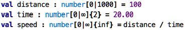
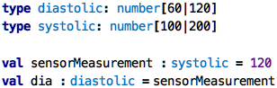

Go back to [Testing Programs](../chapter02_testing/index.md)

# Chapter 03: Types

### What are types

At the beginning of the first chapter we talked about different kinds of
values. We mentioned numeric values (`7`, `10 +2`, `33.33`), string
values (`"Hello"`) and Boolean values (`true`, `false`). We should have
said "type" instead of "kind", because these are the most fundamental,
or _primitive_, types available in essentially all languages: `number`,
`string` and `boolean`. 

Types represent a set of values. Again, as we said before, the `boolean`
type represents the set that contains the values `true` and `false`, the
type `number` is the (infinite) set of numbers from `-inf` over `-1`,
`0`, `1` to `+inf` and string is the set of all possible texts. When we
have a value in hand, we say that it "has a" type or "is of" type. 

### Types as an analysis result

So what can we use types for? We can use them to check certain aspects
of programs to be correct. Consider this example:

&nbsp;&nbsp;[src](http://127.0.0.1:63320/node?ref=r%3A480e3b8e-0509-43e8-9493-4fac219a375e%28chapter03_types%29%2F6455317040166667827)

This program does not explicitly say anything about types. However, we
can ask every expression for its type (by pressing `Ctrl-Shift-T` when a
particular expression is selected). If we do this on the `100`
expression, the type will be reported as `number[100|100]`, i.e., a the
type of numbers between `100` and `100`. The range is only one element
because of course we know the specific number, so the type can be very
precise. We can also ask for the type of the whole `val`; that type is
also `number[100|100]`. Why is this? Because by default, the type of a
`val` is inferred to be the type of the value's expression. The type for 
`time` is then `number[20|20]`, not a big surprise. 

What, however, is the type of `speed`? It is reported to be `number[5.0000|5.000]{inf}`.
That looks strange, it is the type of all numbers between `5.000` and `5.000`,
with an infinite number of decimal points. Two things we can learn: first,
the type system, the engine that determines types of expressions, actually
performs calculations with the ranges of types. And second, this particular
type system reports a type with infinite precision (i.e., a real number) whenever
a division is involved. 

So what have we done here? Our program never said anything explicitly about
types, but the underlying analyser has computed types for us, and we can
use those types to help us understand the program. More useful, however, 
is to use types as constraints.

### Types as Constraints

Look at the following program:

&nbsp;&nbsp;[src](http://127.0.0.1:63320/node?ref=r%3A480e3b8e-0509-43e8-9493-4fac219a375e%28chapter03_types%29%2F6455317040166674022)

Here, we have used the `:` notation to specify a type explicitly. More
specifically, if we specify a type for a `val`, we express that whatever
expression we use as a value for the `val`, its type must be compatible
with the one given explicitly. For example, we say that the `distance`
must be a number between zero and 1,000 and it must have zero decimal
digits (zero is the default, we didn't specify it). For the `time` we
specified a positive number with two decimal digits. The resulting `speed`
is again constrained as a positive number with infinite digits (again, 
every division always gives infinite decimals in the result). How is this 
useful?

Well, if you tried to tried to use a value greater than 1000 for the distance,
or a negative value for the time, you would get an error. Importantly, you
would not get the error when the program runs; instead, you get the error
already _when you write the program_. So the analyser that runs as part of
your programming environment performs certain checks and reports them to 
you as early as possible. This is good, because you don't have to test
these things!

Take a look at the following example from a medical system, and you can see
how types have the potential to avoid errors:

&nbsp;&nbsp;[src](http://127.0.0.1:63320/node?ref=r%3A480e3b8e-0509-43e8-9493-4fac219a375e%28chapter03_types%29%2F6455317040166684137)
 

### Wait, but ...	

... why do I need to specify the type for something if, as in `val`s, I also
always have to give a value and that value can never change? Well, dear reader,
you have a point here. Explicitly given types are much more useful if something
can have _several_ values as the program executes. In the next chapter we will
encounter a place where this is the case: functions. 

Continue with [Functions](../chapter04_functions/index.md)
