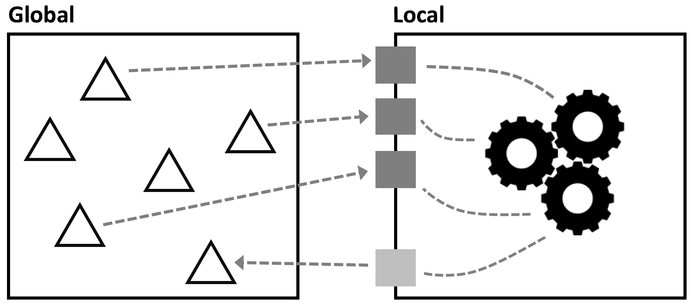

Go back to [Testing Programs](../chapter03_types/index.md)

# Chapter 04: Functions

### Motivation

Consider the following example sheet. It is taken from the domain of healthcare,
and the `E` column calculates a (hypothetical) risk factor based on a person's
age (`A`), their weight (`B`) and their diastolic (`C`) and systolic (`D`) blood
pressures.

&nbsp;&nbsp;[src](http://127.0.0.1:63320/node?ref=r%3A480e3b8e-0509-43e8-9493-4fac219a375e%28chapter03_types%29%2F6455317040166694580)

You notice several things. First, it would be nice if we could rename
the columns according to what is contained in them; right now the
spreadsheet language does not allow us to do that. But second, the way
we handle the formula is really bad. First, the way we reference data
(`$lll`) is not very readable, because the reference expresses
navigation as opposed to expressing meaning (using the absolute
references with `$A2` etc. would not change this). And second, we repeat
the formula in every line. This is really bad: we might make a mistake
copying it down the column, or we might accidentally change something in one
of them, or we might want to update it intentionally and forget to update it
in a line. So, this kind of duplication is really bad.

So the goal _must_ be to write down this expression in only one place.
However, there is a problem: because the expression contains outgoing
dependencies on other cells, it is tied to its context -- the relative
addressing of cells would not work correctly if we moved the expression
to a central location in the sheet (same problem with the absolut references,
we would have to use other absolute references for each case). We 
must somehowget rid of these references!

### From Cells with Dependencies to Parametrized Cells

In programming, whenever we want to get rid of (outgoing) dependencies, we use
the same approach. We create a new "box", and then parametrize it:

A parameter is a named value, just like the `val`s shown earlier. But it
is local to (i.e., visible only) inside that box. Inside the box you put
the expression, but you express it in terms of only those parameters. So
all dependencies in the expression are local to the box, the box is now
generic. 

When you want to use the expression, you map values from the using context
to the parameters, so you "bind" the box to a context. The point is that in
your program, you can have several such bindings, thereby using the box in
different contexts. 

So let us look at an example with cells. The cell labeled `riskFactor` at
the very bottom is this box. It declares the parameters, and then the expression
inside the `riskFactor` cell refers only to these parameters.

&nbsp;&nbsp;[src](http://127.0.0.1:63320/node?ref=r%3A480e3b8e-0509-43e8-9493-4fac219a375e%28chapter03_types%29%2F6455317040166746748)

The cells that formerly contained copies of the risk factor expression now
simply refer to the `riskFactor` cell, providing specific values for the parameters;
the mapping is by position, i.e., the first passed value will be mapped to the
first parameter, and so on. 

We call a cell with parameters a _function cell_, and using it, with a
mapping of the parameters, is referred to as a _call_. In a call, we
first map the parameters and then run the expression inside the function
cell. The resulting value of the call is the value of the expression. As
we can see, the resulting values are the same; but the code avoids the 
duplication of the expression, it only exists once, inside the function cell.

### The importance of types in Function Cells

