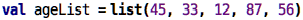
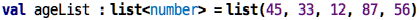
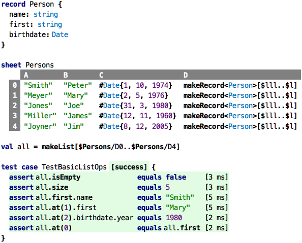
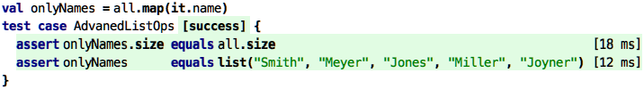
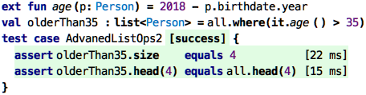
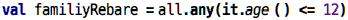
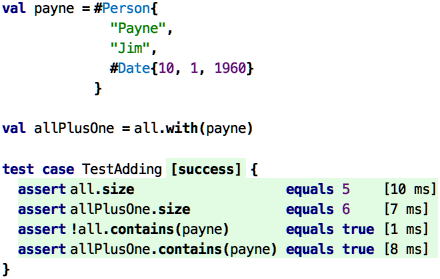
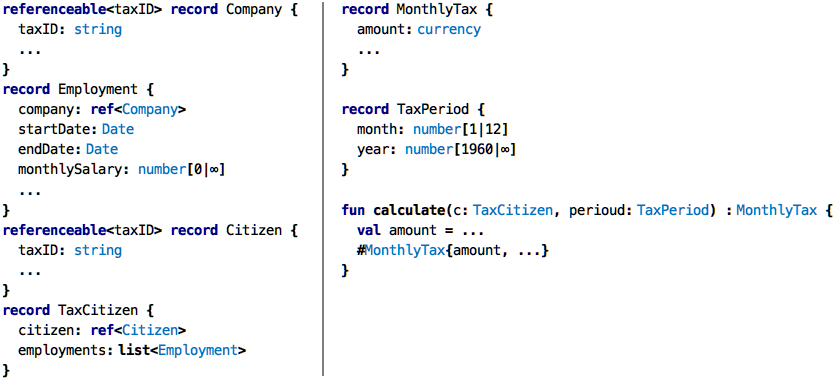

Go back to [Types](../chapter05_structured/index.md)

# Chapter 06: Collections

### Motivation

In the previous chapters, we have discussed records. A record combines several 
values into a new abstraction. For example, values `name: string`, `first: string`
and `birthdate: Date` are combined into a record `Person`. Collections are also
abstractions that combine several values, but they are different from records in
the following ways:

* Records group values of _different_ types (`string` + `string` + `Date`) in
  the example above, whereas collections group values of the same type.

* In Records, each value is identified by a name, the values are anonymous,
  possibly identified by their position ("the 3rd element in a list")
  
* In a record, there is a fixed set of values (`name`, `first`, `birthdate`),
  whereas in collections the number is (usually) not predefined.
  
* Finally, a records are specific declarations; we defined the `Person` record
  to suit our particular needs. Collections are generic, i.e., they are predefined
  and we just use them.
  
The reason for having collections is rather obvious: if we look at the `PatientData` example from the previous chapter, it's rather strange to
only have _one_ blood pressure value. More realistically, you would probably
want to collect several blood pressure measurements over time. Similarly, 
in the introductory example from the last chapter ...

&nbsp;&nbsp;[src](http://127.0.0.1:63320/node?ref=r%3A78a11fed-32ce-4e6e-924f-b137d7d5481f%28chapter06_collections%29%2F930561793188041938)

... can of course also be seen as a list of five records. We want
to have an abstraction that allows us to work us with such as list.

### Introduction to Lists

To get started, let us define a list of 5 integers: 

&nbsp;&nbsp;[src](http://127.0.0.1:63320/node?ref=r%3A78a11fed-32ce-4e6e-924f-b137d7d5481f%28chapter06_collections%29%2F930561793189824209)

We define a `val`ue, as usual, but that value represents a whole list of 
other values, in this case, the ages from column `A` of the spreadsheet above.
What is the type of this thing? Let's see what the type system automatically
infers:

&nbsp;&nbsp;[src](http://127.0.0.1:63320/node?ref=r%3A78a11fed-32ce-4e6e-924f-b137d7d5481f%28chapter06_collections%29%2F930561793189824832)

Wow, that is a rather complex type! Let's see. It is a list. Inside the
`<...>` it specifies the type of the elements. In this case, all elements
are (integer) numbers, and as we can see by analyzing the values, the number
is between 12 and 87, the smallest and the largest of the values in the list.
In the square brackets behind the angle brackets, the minimum and maximum
length of the list is defined. Since we derived the type from the list
value that had exactly five elements, the length is also be derived to be
exactly five. Let's see what happens if we generalize the type:

&nbsp;&nbsp;[src](http://127.0.0.1:63320/node?ref=r%3A78a11fed-32ce-4e6e-924f-b137d7d5481f%28chapter06_collections%29%2F930561793189827434)

Here, we have _manually_ specified the type to just be a list of
numbers; no number range, and no list length. This is still valid. 
Remember that earlier we said that for a `val` declaration, the type
of the value (`list(45, 33, 12, 87, 56)`) must be the same or a subtype
of the specified type (if one is specified). This is intuitively the
case here: numbers between 12 and 87 are clerly a subtype of numbers
in general, and a list with five elements is a subtype of a list with
an arbitrary length. There is an additional detail about something 
called covariance which we skip here :-)

So in the code above, we see the word "list" twice. Behind the colon
it is used as a type, similar to `number` or `Person`. What is special
about this type is that it also specifies the _type of the elements in
in the list_ between the angle brackets. This is new: one type (`list`)
has a second type (`number`) as a parameter. We will return to this below.
The second use of `list` is behind the equals sign. As we know from 
earlier examples, we expect an expression there. So the `list(a, b, ...)`
is an expression that constructs a new list. The elements of the list
are given in parentheses. If it is supposed to be an empty list, you
can leave the list of elements empty. However, then you have to specify
the type of the elements explictly (because the type system cannot
derive it from the elements). Here is an empty list of strings:

&nbsp;&nbsp;[src](http://127.0.0.1:63320/node?ref=r%3A78a11fed-32ce-4e6e-924f-b137d7d5481f%28chapter06_collections%29%2F930561793189831238)

There are of course other ways of creating lists. Below we will see how
to create new lists by adding or removing elements from an existing list.
However, we can also construct completely new lists in other ways that
with the `list` expression. Here is a way to construct a list from a 
linear range of cells in spreadsheet:

&nbsp;&nbsp;[src](http://127.0.0.1:63320/node?ref=r%3A78a11fed-32ce-4e6e-924f-b137d7d5481f%28chapter06_collections%29%2F930561793189834321)

Each row in the sheet, in row `D`, creates a `Person` value instance
using the `makeRecord` we have seen before. We then declare a value 
`all` that is a `list<Person>`; it uses `makeList` to grab the persons
in column `D` of the spreadsheet.

### Processing Lists

Let's look at what we can do with lists. The tests in the code above
demonstrate the basics. Fundamentally, everything we do with lists, 
once they are constructed, uses dot notation. First we check that the
list is not empty; `isEmpty` returns a `boolean`. Then we ask the list
for its size and expect 5. We then use the `first` operation to get the
first `Person` in the list; we chain a `.name` to retrieve that person's
name and assert that it is "Smith". Using `at(pos)` we can retrieve the
element at position `pos`. Note that these positions are 0-based, like
all indices in computing. The last assertions demonstrates this.

The next set of examples introduce something fundamentally new: we
will use expressions as arguments to function calls! So far, we have
only ever passed values to functions, i.e., data. Now we are passing
code to functions. Functions to which we can pass code are called 
_higher order_ functions. This is a somewhat advanced concept if you
try to understand how it works under the hood. I will (probably)
explain this (much) later in the tutorial. For now, we will just use
these new kind of function, and this is actually quite easy.

**Mapping**: Let's say we want to create a new list from the existing example
list above that contains only `name` of each person. So we will step
through the `all` list, access the `Person` at each index, grab their
name, and then package all of these into a new list. Here is how
you do this:

&nbsp;&nbsp;[src](http://127.0.0.1:63320/node?ref=r%3A78a11fed-32ce-4e6e-924f-b137d7d5481f%28chapter06_collections%29%2F930561793192211332)

The value `onlyNames` is now a new list (`all` of course remains 
unchanged) that contains only the names. As the first assertion 
shows, the two lists have the same size, not surprisingly.

So how does `map` work? The `map` higher-order function _internally_ runs through all the elements of the list on which we call it (here: `all`). For each element, it calls the code that we pass to `map`. That code is an expression, that creates a new value. These new values will be packaged
into a new list, which is then the value returned by `map`. The code
we pass (technically called a lambda), can use the special expression
`ìt` to refer to the element from the original list for which we're
currently calculating the new value. So because we map over a list
of `Person`s, `it` is always of type `Person`. This is why we can
call `.name` on `it`. So to be clear: the `it.name` is called five
times in our example, once for each of the five persons in the `all`
list. The iteration, and the calling, is handled internally to `map`.

**Filtering**: We can also filter the contents of a list according to a criterion. Look at this code:

&nbsp;&nbsp;[src](http://127.0.0.1:63320/node?ref=r%3A78a11fed-32ce-4e6e-924f-b137d7d5481f%28chapter06_collections%29%2F930561793192252813)

We first define a function `age` that computes a person's age 
based on their birthdate and the current year. We then take `all`
list and pick from it only those elements where the age is older
than 35. Like the `map` function, `where` does this by calling 
the expression we pass to it for each element in the list. But
instead of creating a new list with the result of that expression,
it uses the exact element from the old list, but _only_ if the
expression we evaluates to true. So the resulting list is still
a `list<Person>`, but it might have fewer elements than the
original, because those where the expression is false are not
added. In our example, only the last element in the list, Jim Joyner,
is younger than 35. We can test this by using the `head` function
on the two lists: `head(n)` returns the first `n` elements from
a list; since only the last one is filtered out, the first four
elements in both lists are the same.

 **Checking**: Lets say we want to buy a train group ticket for the 
 folks in the `all` list. We can get the _retired_ rebate if all of 
 the people in the group are older than 60. How can we check for this?`
 
 One way is to use `where`: we write essentially the same code as before,
 but use 60 as the age threshold. Then we check if the filtered list has
 the same length as the original one:
 
 &nbsp;&nbsp;[src](http://127.0.0.1:63320/node?ref=r%3A78a11fed-32ce-4e6e-924f-b137d7d5481f%28chapter06_collections%29%2F930561793192465547)
 
 There's a simpler way though, and it looks like this:
 
&nbsp;&nbsp;[src](http://127.0.0.1:63320/node?ref=r%3A78a11fed-32ce-4e6e-924f-b137d7d5481f%28chapter06_collections%29%2F930561793192508568)

The `all` operation also takes a Boolean expression. And it evaluates
to true if the expression is true for _all_ elements of the list. 
Otherwise it returns false. In terms of Boolean algebra, it joins
all of the expression by `and`. You can see how this is cumbersome:

&nbsp;&nbsp;[src](http://127.0.0.1:63320/node?ref=r%3A78a11fed-32ce-4e6e-924f-b137d7d5481f%28chapter06_collections%29%2F930561793192530667)

There is also the correponding function for `or`-ing the elements
together. Let's say we get the family group rebate as soon as there
is one group member under 12 years of age: 

&nbsp;&nbsp;[src](http://127.0.0.1:63320/node?ref=r%3A78a11fed-32ce-4e6e-924f-b137d7d5481f%28chapter06_collections%29%2F930561793192611276)

There are many more (higher-order) functions on lists that do all kinds
of fancy things. Some are not so easy to understand, and we will ignore
those for now. What is important here is that you understand the idea of 
lists as ordered collections of similarly-typed elements, and that you
get a feeling for this notion of "passing code into functions", as a way
of parametrizing the function with specific behavior. 

**Adding and Removing Elements:** We already
used higher-order functions to create a new list from an existing one, 
but we only did it as "bulk" higher-order functions. 
How do we add a single new element to a list? Here is how:

&nbsp;&nbsp;[src](http://127.0.0.1:63320/node?ref=r%3A78a11fed-32ce-4e6e-924f-b137d7d5481f%28chapter06_collections%29%2F930561793193046341)

Using the `with` operation, we can create a new list that has the contents
of the original one as well as the one passed as the argument of `with`. 
Because lists are values, _the original list remains unchanged_, as the
test shows.

### Databases and the System Boundary

Based on the observation above that we can not change the same list, but
only create new ones with additional elements (or fewer, using `without`),
how would we build a database? A database is a store of records where programs
can add or remove records as the program executes. The database, i.e., the
list of values, _changes over time_. If this is the case, a database, by
definition, is not a value, because it is _not_ immutable. At different
times during the execution of a program a particular database has different
contents. The database is a _variable_. 

In this part of the turorial we do not (yet) look at language features that
allow variables to change over time because it makes writing, understanding, 
and debugging programs much more complicated. It is beyond (at least a strict
definition of) functional programming. So how can we use the skills
we have obtained so far for something useful? How can we write a useful 
program if we cannot keep track of how stuff changes over time? Take a look
at the following picture:

 

Let us say we are responsible for building a tax calculation
system: based on input from all kinds of other systems and interactions with users,
the system is reponsible for calculating the different components of the tax a
citizen has to pay each year. As a software architect, we use a principle called
separation of concerns (we will discuss this and a few others later in this tutorial),
where we try to isolate different aspects of the overall problem. In this particular
example, we distinguish between two aspects: the core of the system that performs the 
actual calculations and decisions about what and how much somebody has to pay for a 
given time period based on data that is handed in, and a driver which interacts with 
the user, other systems and its own database.
 
The driver is in charge of "running the show". For example, whenever a new month
is over, the driver revisits all citizen under its purview, collects the data
necessary for tax calculation from other systems, and then asks the
calculation core to perform the actual calculation. Once that calculation is done,
the core hands the results back to the driver, who then stores the data in a database
and potentially triggers other, downstream systems. 
 
Here is the thing: in this architecture, it is completely feasible to implememt the
core as a functional program. So let's say you are an expert in tax calculation, and
your organization decides to use a DSL to represent the core calculations. You, as
a tax expert, read this tutorial here because you are now asked to "become a programmer"
so you can use this DSL productively. If the system is built according to this architecture
shown above, you can absolutely stay in your simpler, functional world. 
Many systems are in fact built exactly this way. We will use this example later in this
tutorial to illustrate many advanced ideas.

Here is how one could design the language part of such as system:

&nbsp;&nbsp;[src](http://127.0.0.1:63320/node?ref=r%3A78a11fed-32ce-4e6e-924f-b137d7d5481f%28chapter06_collections%29%2F930561793196704837)

In the left column you
see a couple of records that represent the data based on which the tax calculation will
be performend. The driver is reponsible to populate this data correctly by retrieving
data from its database or talking to other systems. As the tax expert we mentioned before
we don't really care how the driver does this. In the right column you primarily see function
that is used as the interface between the driver and the calculation core: the function `calculate` 
takes the data that is assembled by the driver (here: an instance of `TaxCitizen`) as well
as the month for which we are supposed to calculate the tax. The function then returns an
instance of `MonthlyTax` that it calculated based on all the complicated decisions and 
calculations that are the tax law for the particular period. Calculating this correctly is
the only thing this function (and hence you, the tax expert) is reponsible for. Once returned,
it is the driver's reponsibility to store the new `MonthlyTax` in the database and initiate
downstream processes (such as printing a tax bill).

  

 

 
 
 
 
 
 
 
 
 
 
 
 
 
 
 

