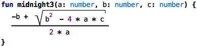
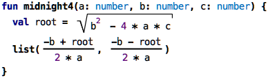
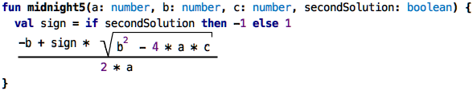
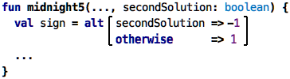
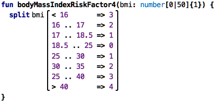
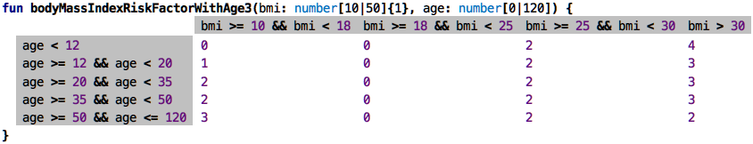
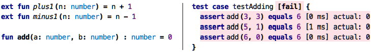

Go back to [Types](../chapter06_collections/index.md)

# Chapter 07: Decisions and Calculations

In the end, programming is about performing calculations and making decisions,
often interleaved. To be able to make these, we need data structures (as we
have explained in the previous two chapters) and ways of expressing behavior
(expressions and functions, as introduced even earlier). Once the decisions
and calculations become more complicated, it becomes important how we 
represent them to keep them understandable to ourselves and other people
who might want to read and understand them them. A really important ingredient
for making this work is modularity, which we explain in the next chapter.
But it is also about choose appropriate abstractions in the first place. I 
will provide some ideas in this chapter.

### Mathematical Notations

Remember the midnight equation from school? I actually didn't, and I had
to look it up :-) But I did remember that it uses a few mathematical 
notations that serve as a nice demo here. So here is the midnight equation,
packaged into a function:

&nbsp;&nbsp;[src](http://127.0.0.1:63320/node?ref=r%3Af86acbf6-5925-4972-9b81-61d10c38bde1%28chapter07_decAndCalc%29%2F311056592387669028)

Do you recognize it? Hardly. You can make it slightly better by introducing
intermediate values and names, for example, like this:

&nbsp;&nbsp;[src](http://127.0.0.1:63320/node?ref=r%3Af86acbf6-5925-4972-9b81-61d10c38bde1%28chapter07_decAndCalc%29%2F311056592387779123)	

But you still have to work on recognizing it. A much better version would
be this one:

&nbsp;&nbsp;[src](http://127.0.0.1:63320/node?ref=r%3Af86acbf6-5925-4972-9b81-61d10c38bde1%28chapter07_decAndCalc%29%2F311056592387760470))

In KernelF, the language we use for this tutorial, you can actually write
the formula exactly like this, and you can execute it; all three versions
return the same, at least for one test case:

&nbsp;&nbsp;[src](http://127.0.0.1:63320/node?ref=r%3Af86acbf6-5925-4972-9b81-61d10c38bde1%28chapter07_decAndCalc%29%2F311056592387818002)

So why am I showing this? Because it demonstrates how important it is to 
select the right _notation_. All three representations of the formula do 
exactly the same thing. Moreover, they use exactly the same abstractions:
multiplication, subtraction, division, and so on. The only difference is
the way these abstractions are represented in terms of the symbology used
here. 

There's of course one detail that has been missing (did you notice?): the
midnight equation has two results, the plus in the numerator can also be
a minus. You could implement this by returning two values, modularizing
the calculation accordingly:

&nbsp;&nbsp;[src](http://127.0.0.1:63320/node?ref=r%3Af86acbf6-5925-4972-9b81-61d10c38bde1%28chapter07_decAndCalc%29%2F311056592387894925)

The return type is now a list, and you would have to take that into account
when working with the return value. Another approach would be to change the function so that you can tell it whether to compute the first or the second solution: 
 
&nbsp;&nbsp;[src](http://127.0.0.1:63320/node?ref=r%3Af86acbf6-5925-4972-9b81-61d10c38bde1%28chapter07_decAndCalc%29%2F311056592387904856)

However, in all of these cases, the use of the mathematical notation really
makes things much easier to read and understand. So, if you are involved
with designing a DSL, make sure you properly motivate the language designers
to use nice notations. It's not just "cosmetics"!
 
 
 
  
 

### Complex Decisions

**Single Dimension:** In the last example, we have seen a very simple decision: based on whether
the caller of the function wanted the first or second solution, we compute
a `sign` value using an `if` expression. We have seen `if` before: if the
Boolean value behind the `if`, the condition, is true, the overall `if`
evaluates to the `then` value; otherwise it evaluates to the `else` value.
If, therefore, is a way to make a decision between two alternatives.
 
Another way of writing the same decision is by using the `alt` expression:

&nbsp;&nbsp;[src](http://127.0.0.1:63320/node?ref=r%3Af86acbf6-5925-4972-9b81-61d10c38bde1%28chapter07_decAndCalc%29%2F3051004821910492143)

However, the `alt` expression can be used to have more than two alternatives.
Below is an example that returns a risk factor based on somebody's body 
mass index:

&nbsp;&nbsp;[src](http://127.0.0.1:63320/node?ref=r%3Af86acbf6-5925-4972-9b81-61d10c38bde1%28chapter07_decAndCalc%29%2F3051004821910499206)

As you can see, we use several alternatives that cover the range of values
of the body mass index, and depending on the amount of over and under-weight
we assign a risk factor (this is not a real medical example, I made this
up based on other risk classifications I know from medical projects!).
There are several things we can see here. First, it is really a bit hard
to read, because of all the repetition of numbers. There are several ways
to make this more readable. First, we can use the `inRange` operation:

&nbsp;&nbsp;[src](http://127.0.0.1:63320/node?ref=r%3Af86acbf6-5925-4972-9b81-61d10c38bde1%28chapter07_decAndCalc%29%2F3051004821910536913)

This is a little bit more compact but still kinda verbose (notice the `[`
on the upper limit to express that it's `<` instead of `<=`). One reason
why this is still verbose is that we have to repeat the `bmi.inRange` again
and again. The reason for this, in turn, is that we could write all kinds
of Boolean expression here; for example, we could take into account the
age of the person: 

&nbsp;&nbsp;[src](http://127.0.0.1:63320/node?ref=r%3Af86acbf6-5925-4972-9b81-61d10c38bde1%28chapter07_decAndCalc%29%2F3051004821910643479)

It's very obvious that this will get out of hand quickly, and we will get 
back to this case later; for now, let us look at another way of splitting
a range: 

&nbsp;&nbsp;[src](http://127.0.0.1:63320/node?ref=r%3Af86acbf6-5925-4972-9b81-61d10c38bde1%28chapter07_decAndCalc%29%2F3051004821910672135)

The `split` expression is explicitly designed to break down _one_ value
into subranges; this is why the value, `bmi`, is pulled before the various
cases. This is why it does not have to be mentioned in each case. As a flip
side, you cannot add a second value, such as the `age` in the example above.
It is a nice example how it is useful that a special-purpose expression can be
used to handle a (presumably) common problem in a way that is much more readable
than using a more general-purpose concept like `alt`.

**Two Dimensions:** Often you have to make a decision based on two criteria. For example,
it is quite plausible (again: no real medical relevance here!) that the risk factor involved
in somebody's weight depends on their age. Here is a two-dimensional decision table that
represents such as decision:

&nbsp;&nbsp;[src](http://127.0.0.1:63320/node?ref=r%3Af86acbf6-5925-4972-9b81-61d10c38bde1%28chapter07_decAndCalc%29%2F3051004821911985789)

This decision table evaluates to the number in the (content) cell depending on which column
and row headers evaluate to true:

&nbsp;&nbsp;[src](http://127.0.0.1:63320/node?ref=r%3Af86acbf6-5925-4972-9b81-61d10c38bde1%28chapter07_decAndCalc%29%2F3051004821912032681)

A note on the notation: even though it uses a tabular notation like the spreadsheets we have seen before. the semantics, i.e., the meaning, is different: it's not just a collection of "cells with values". Instead, the row and column headers are required to be Boolean expressions, and the result of the evaluation of the overall table is a single value.

Instead of using this tabular notation, one could represent this decision 
as nested `alt` expressions. However,
because the two dimensions are independent and (potentially) every 
combination has a different risk, this becomes very hard to read quickly.

**More Dimensions:** Sometimes decisions depend on more than two independent dimensions. Since
we cannot sensibly represent a 5-dimensional table, we need a different mechanism. So let's introduce
our multi-decision tables. They work as follows: first, they are evaluated in row order. Rows
that are mentioned earlier are matched first. Each of the colums is matched by `==`, 
the columns in each row are anded together. If a cell contains comma-separated
values, these count as an or. As an example, we use a fictional computation of a train fare;
these are notoriously complicated.

&nbsp;&nbsp;[src](http://127.0.0.1:63320/node?ref=r%3Af86acbf6-5925-4972-9b81-61d10c38bde1%28chapter07_decAndCalc%29%2F3051004821912537523)

The overall function takes a `CustomerData` for matching against the table; we'll discuss this
below. The table returns two values, packaged into a tuple, accessible positionally via the
square brackets. So the total price for the distance travelled is the product of the `baseFare`
and the distance. We then compute an `rebateFactor`; if you are within a city ("Nahverkehrsverbund"),
you get no rebate, the factor is 1.00, else it is computed from the given rebate percentage.
Finally, we compute the resulting fare by multiplying the distance-dependent `basicFare` by the
rebate factor. 
  
So, to illustrate how this table works, let us work through a couple of test cases:

&nbsp;&nbsp;[src](http://127.0.0.1:63320/node?ref=r%3Af86acbf6-5925-4972-9b81-61d10c38bde1%28chapter07_decAndCalc%29%2F3051004821912555231)

* `regularGuyInHesse`: None of the specific lines matches, so it "falls through" to the last line, resulting in a fare of 3, multiplied by 10 km, means 30.00. 
* `youngGuyInHesse`: here, the first line matches, since it has no state constraint. We pay 10.00.
* `youngGuyInBavaria`: here, also the first line matches, for the same reason.
* `adacMemberInBW`: here we match the state, plus the `adacMember` flag; resulting in line 2. So this would a km price of 2, with 20% rebate.
* `adacMemberInHesse`: there is no ADAC rebate in Hesse, so they pay the regular price of 3 per km.
* `adacMemberInBavariaInCity`: Being in a city invalidates all rebates, so that guy pays the regular  Bavaria price of 20.00.  

### Consistency Checking

While the tables are better than a whole bunch of nested `if`s or `alt`s, it might still be hard
to get them correct. For example, in the `bodyMassIndexRiskFactorWithAge` above, there is a bug:
in the last line, it should say `age >= 50` and not just `>`. The current table does not handle
the case where `age == 50`: we say the table is incomplete. How can we find such errors? Of course
we can test. But if we don't happen to test for age 50, we won't find it. Is there a better way?
Yes, there is. Because we have expressed it as a decision table, and because, by definition, 
decision tables have to be complete, we can use a so-called solver to check this completeness.

If we apply the solver to that table, it reports: 

    Error: Missing Row. For instance, the following case is not covered: age = 50. 

A solver tries to proof that for all possible values, the tables has a result. If it finds an 
example for which this is not the case, it reports this example. It reports such an example
to the user; `age = 50` is such an example. 

Here's another one with a bug. See it?

&nbsp;&nbsp;[src](http://127.0.0.1:63320/node?ref=r%3Af86acbf6-5925-4972-9b81-61d10c38bde1%28chapter07_decAndCalc%29%2F3051004821912836857)

The solver marks lines three and four and reports:

    Error: Overlapping Rows: These rows all match in the following case: age = 35
    
Here we have a non-uniqueness: an age of 35 matches two lines, so the table cannot uniquely decide.
So overlap-freedom is another thing that the solver can automatically check. One more:

&nbsp;&nbsp;[src](http://127.0.0.1:63320/node?ref=r%3Af86acbf6-5925-4972-9b81-61d10c38bde1%28chapter07_decAndCalc%29%2F3051004821912859977)

Is this one correct? Notice how we now check the `bmi` only for values greater than 10, 
and we never check any age greater than 120. Why is this _not_ an error? Because the 
variables `bmi` and `age` have range limits, expressed in the function signature. So, when
checking the table for completeness and consistency, the solver of course takes into account
what values are possible in the first place, based on constraints expressed in other places
in the program. If we were to decide that we now allow for a BMW less than 10 or for ages greater
than 120, and we adapted the types in the functions accordingly, the solver would start reporting
errors.

We use the solver also to verify the multi-decision tables (the fare example). Here, we
check that a line does not shadow lines further down, because then those would never ever
apply. We also check for completeness and consistency in `alt` expressions. Generally, 
solvers can find many non-trivial bugs.

### Recursion

Let's say you're a little child. You want to add two numbers. But the only thing you can do,
in terms of your math expertise, is to add one to a number or substract one. Now let's also 
imagine you are a little child who can write code :-) How would you implement adding two numbers 
when you can only know how to add or subtract one? Here is what we have initially:

&nbsp;&nbsp;[src](http://127.0.0.1:63320/node?ref=r%3Af86acbf6-5925-4972-9b81-61d10c38bde1%28chapter07_decAndCalc%29%2F3051004821913096173)

The `inc` function is your low level mechanism to add one to a number. The add function
should now be implemented by only using `inc`. For now, we implement it to just return zero,
which is why all the tests fail. Here is how you would write this:

&nbsp;&nbsp;[src](http://127.0.0.1:63320/node?ref=r%3Af86acbf6-5925-4972-9b81-61d10c38bde1%28chapter07_decAndCalc%29%2F3051004821913097989)

So what is happening here? Let's say we want to add `3 + 3`. We can rewrite
this as `(3 + 2) + 1`, where we have introduced one of our basic operations
`+1` that we know how to do. `2`, in turn, is of course `3 - 1`, which uses
the other thing we know how to do, subtracting one. So we are at 

    3 + 3 ==> (3 + (3 - 1)) + 1

which means that we have sucessfully removed every operation except plus 
and minus one. Here is the key observation: how can we compute 
`(3 + (3 - 1))`? We can simply _invoke `add` again_. If we expand the complete 
calculation, we get

    add(3, 3) 
        ==> add(3, 2) + 1
                ==> add(3, 1) + 1 + 1
                        ==> add(3, 0) + 1 + 1 + 1
                                ==> 3 + 1 + 1 + 1
                                    ==> 6
                            6
                    6
            6
    6
    
    
A function calling itself with 
other arguments is called _recursive_. A recursive function must at some
point stop calling itself; in our case, when we call add with the second
argument as zero, we know that there's no more work to do and we can
just return the first argument. This is why we use the `alt` expression
in the function to distinguish the recursive case from the base case.

Recursion is not so easy to understand. Many programmers, including myself,
have problems understanding it once its use becomes more involved than in
this example. I would expect that you will likely not use it much. But it
is useful to know about it. But it is used, even by people who are not 
necessarily programmers. Take a look at the following code:
                 
 

And yes, this is code! It looks like a Word document, which is intended:
these recursive formulas were found in a Word document that defines recursive,
numerical functions in actuarial math in insurances. We have built a language
that resembles the Word notation as closely as possible. Notice how the 
`l` function calls itself with a different value for the variable `x`. 

### Tracing Computations

