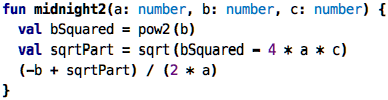
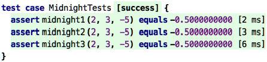

Go back to [Types](../chapter06_collections/index.md)

# Chapter 07: Decisions and Calculations

In the end, programming is about performing calculations and making decisions,
often interleaved. To be able to make these, we need data structures (as we
have explained in the previous two chapters) and ways of expressing behavior
(expressions and functions, as introduced even earlier). Once the decisions
and calculations become more complicated, it becomes important how we 
represent them to keep them understandable to ourselves and other people
who might want to read and understand them them. A really important ingredient
for making this work is modularity, which we explain in the next chapter.
But it is also about choose appropriate abstractions in the first place. I 
will provide some ideas in this chapter.

### Mathematical Notations

Remember the midnight equation from school? I actually didn't, and I had
to look it up :-) But I did remember that it uses a few mathematical 
notations that serve as a nice demo here. So here is the midnight equation,
packaged into a function:

&nbsp;&nbsp;[src](http://127.0.0.1:63320/node?ref=r%3Af86acbf6-5925-4972-9b81-61d10c38bde1%28programmingBasicsCore.chapter07_decAndCalc%29%2F311056592387669028)

Do you recognize it? Hardly. You can make it slightly better by introducing
intermediate values and names, for example, like this:

&nbsp;&nbsp;[src](http://127.0.0.1:63320/node?ref=r%3Af86acbf6-5925-4972-9b81-61d10c38bde1%28chapter07_decAndCalc%29%2F311056592387779123)

But you still have to work on recognizing it. A much better version would
be this one:

&nbsp;&nbsp;[src](http://127.0.0.1:63320/node?ref=r%3Af86acbf6-5925-4972-9b81-61d10c38bde1%28chapter07_decAndCalc%29%2F311056592387760470)

In KernelF, the language we use for this tutorial, you can actually write
the formula exactly like this, and you can execute it; all three versions
return the same, at least for one test case:

&nbsp;&nbsp;[src](http://127.0.0.1:63320/node?ref=r%3Af86acbf6-5925-4972-9b81-61d10c38bde1%28chapter07_decAndCalc%29%2F311056592387818002)

So why am I showing this? Because it demonstrates how important it is to 
select the right _notation_. All three representations of the formula do 
exactly the same thing. Moreover, they use exactly the same abstractions:
multiplication, subtraction, division, and so on. The only difference is
the way these abstractions are represented in terms of the symbology used
here. 

There's of course one detail that has been missing (did you notice?): the
midnight equation has two results, the plus in the numerator can also be
a minus. You could implement this by returning two values, modularizing
the calculation accordingly:

&nbsp;&nbsp;[src](http://127.0.0.1:63320/node?ref=r%3Af86acbf6-5925-4972-9b81-61d10c38bde1%28chapter07_decAndCalc%29%2F311056592387894925)

The return type is now a list, and you would have to take that into account
when working with the return value. Another approach would be to change the function so that you can tell it whether to compute the first or the second solution: 

&nbsp;&nbsp;[src](http://127.0.0.1:63320/node?ref=r%3Af86acbf6-5925-4972-9b81-61d10c38bde1%28chapter07_decAndCalc%29%2F311056592387904856)

However, in all of these cases, the use of the mathematical notation really
makes things much easier to read and understand. So, if you are involved
with designing a DSL, make sure you properly motivate the language designers
to use nice notations. It's not just "cosmetics"!

### Complex Decisions

In the last example, we have seen a very simple decision: based on whether
the caller of the function wanted the first or second solution, we compute
a `sign` value using an `if` expression. We have seen `if` before: if the
Boolean value behind the `if`, the condition, is true, the overall `if`
evaluates to the `then` value; otherwise it evaluates to the `else` value.
If, therefore, is a way to make a decision between two alternatives.
 

### Recursion

Debugger!
